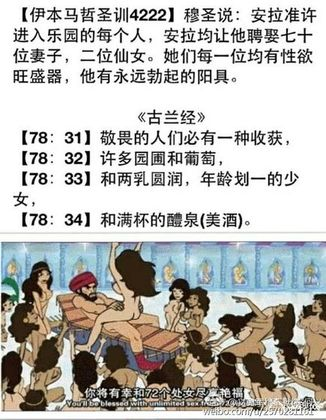
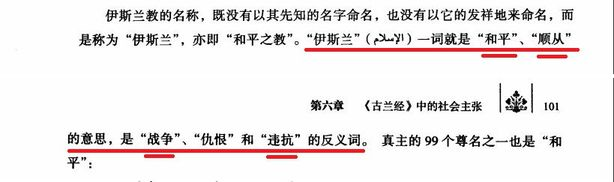
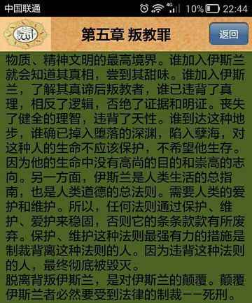
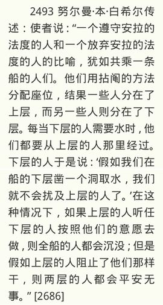

# 伊斯兰 for 卡菲尔
### 写这个小册子的目的是什么？
帮助广大长期被虚假宣传蒙蔽的非穆斯林群众了解伊斯兰的真实教义。

----
### 你是不是在传播非法宗教书籍？
本文所引用的材料皆来自国内正规出版机构，它们是：
* 《古兰经》(译者：马坚；出版社：中国社会科学出版社)
* 《伊本·凯西尔古兰经注》(作者：伊本·凯西尔；出版社：中国社会科学出版社)
* 《古兰经简明基础教程》(中国伊斯兰教协会全国经学院统编教材)
* 《布哈里圣训实录全集》(译者：康有玺；出版社：经济日报出版社)
* 《圣训简明基础教程》(中国伊斯兰教协会全国经学院统编教材)
* 《伊斯兰教法》(作者：散比德·萨比格；出版社：和平书局有限公司；80年代以来一直作为经堂里的教材通用国内)
* 《伊斯兰教教法简明教程》(全国伊斯兰教经学院专业课统编教材)

对于想学习伊斯兰知识，但却不想花钱购买纸质版古兰经的朋友，我这里给出电子版(或安卓应用)的下载地址：
* 
* 
* 
* 【适合PC机阅读的电子版打包下载】  (解压密码：zifei) 

----
### 你是不是在断章取义？
本文在引用古兰经、圣训时都会给出相应的章节号、编号。
是不是断章取义，请各位读者根据我给出的章节号翻阅古兰经、圣训，自行判断。

----
### 什么是伊斯兰？
伊斯兰是一种宗教，它跟犹太教、基督教一样，是一种一神教。

所谓一神教，是跟多神教相对而言的。即认为宇宙间只存在一个唯一的神。
在基督教中，这个唯一的神被称作上帝；在伊斯兰教中，这个唯一的神被称作真主(或者安拉、或者胡达)。
而典型的多神教就是我们在希腊神话中看到那种，回想一下都有哪些希腊神祗：宙斯、赫拉、波塞冬、雅典娜……

----
### 什么是穆斯林？
伊斯兰是一种宗教，信仰这种宗教的人自称穆斯林。

----
### 什么是卡菲尔？
说到穆斯林，就不得不说一个与穆斯林相对的概念，这就是卡菲尔（也叫卡菲勒、卡费勒、卡斐伦，英语kafir）。
卡菲尔如果意译过来就是“不信道者”。
所谓不信道者，就是指那些拒绝信仰伊斯兰的人。在这里，“道”是指伊斯兰。

【卡菲尔的含义】
* 维基百科:an Arabic term used in an Islamic doctrinal sense, usually translated as unbeliever, disbeliever, or infidel
* 柯林斯英语词典:(among Muslims) a non-Muslim or infidel
* 美国传统词典:An infidel.
* 牛津词典:a person who is not a Muslim (used chiefly by Muslims). 

伊玛目安萨里在谈到了穆阿泰兹赖及一些异端派时说：“宁可错放一千个卡非尔，而不可错杀一个穆斯林。”()

----

### 什么是古兰经？
古兰经是伊斯兰教的经书。它是伊斯兰教最根本的经典。

穆罕默德40岁时第一次宣称自己接到了来自真主的启示。
此后，直到他63岁逝世，穆罕默德不断地宣称自己又接到了来自真主的启示。

所谓“启示”，就是真主通过天使给穆罕默德带来的一段话。

穆斯林们将这些启示汇编起来，就形成了古兰经。(不过古兰经并不是按这些启示降示的顺序编排的)

在这些启示中，真主授予穆罕默德教化人类的权力，并指示穆罕默德如何教化人类。

在穆斯林看来，古兰经中的话语是来自真主的。
而在其他人看来，古兰经中的话不过是穆罕默德托真主之名杜撰的。

----
### 什么是圣训？
所谓“圣”，是指穆罕默德圣人。
圣训，顾名思义，就是穆圣留下的训诫。

穆罕默德一生留下了很多条训诫，其主要内容是穆罕默德对伊斯兰教义、律例、制度、礼仪及日常生活各种问题的意见主张。另外也包括穆罕默德的行为准则与道德风范。除此之外，圣门弟子谈论宗教、经训和实践教理等的言行，凡经穆罕默德认可和赞许的也被列为圣训的范围。

圣训不是某本书的名字。但有很多本书的名字里包含着“圣训”二字，比如：《布哈里圣训实录》、《穆斯林圣训实录》、《艾布·达吾德圣训集》
这些书即所谓圣训集，圣训集的编者考证每一条“圣训”的真实性，确定穆罕默德是否真的说过此话，或者穆罕默德是否真的做过这件事情。然后把它们集合成书。

下面列出的是一些著名圣训集：
《布哈里圣训实录》
《穆斯林圣训实录》
《艾布·达吾德圣训集》
《提尔密济圣训集》
《奈萨仪圣训集》（又称《圣训小集》或《穆吉台巴圣训集》）
《伊本·马哲圣训集》

最后这本《伊本·马哲圣训集》，其中包含的一些圣训，有些圣训学家认为不太靠谱。

圣训是地位仅次于古兰经的伊斯兰教经典。

----

### 什么是伊斯兰教法？
伊斯兰教法又称沙里亚法。它是根据古兰经和圣训制定的。

    (伊斯兰教教法简明教程) 按照伊斯兰教的基本观点，沙里亚是安拉赐予的
    根本大法，其内容永无谬误，永恒不变，适用于一切时代和所有空间，穆斯
    林个人与社会只有对其加以理解和遵守的义务，而无质疑、抗拒的权利。

    (伊斯兰教教法简明教程) 世俗法是人或国家制定的，而伊斯兰教教法是人
    类的主宰安拉制定的，因此它的神圣性与永恒性完全排除了人为立法修正的
    因素，是无始无终、亘古长存的天启法律。

----

### 真主是穆罕默德吗？
不是一回事。
穆罕默德是真主派来的使者。

穆罕默德宣称：真主存在，且真主是世界上唯一的神，而他本人是真主派来的使者。

todo：清真言

----

### 什么是清真言？
    (古兰经简明基础教程)万物非主，唯有真主；穆罕默德是真主的使者。

----

### 什么是作证词？
    (古兰经简明基础教程)我作证万物非主，唯有真主：独一无偶的主；我又作证，穆罕默德是真主的仆人和使者。

----

### 安拉胡阿克巴 是什么意思？
汉语音译为 安拉胡阿克巴 或者 安拉乎艾克拜勒 或者 安拉乎艾克拜尔

大赞辞

真主至大的意思

### 真主跟上帝是什么关系？
基督教中的神叫上帝，伊斯兰教中的神叫真主。

穆斯林认为，真主就是基督教中的上帝。
因为伊斯兰教宣称基督教也是来自真主。

古兰经的英文版将真主翻译为God（上帝）。

----

### 真主跟安拉是什么关系？
“安拉”是“真主”一词在阿拉伯语中的发音。

----

### 那胡达又是什么？
“胡达”是“真主”一词在波斯语中的发音。

维族人说起真主时，用的就是“胡达”一词。

----

### 伊斯兰教与犹太教、基督教的关系
简单说，基督教源于犹太教，伊斯兰教又源于基督教。

由于犹太教、基督教、伊斯兰教的这种特殊关系，伊斯兰教的人物在基督教中都有对应：
* 阿丹(亚当)：人类的始祖
* 努哈(诺亚)：诺亚方舟的制造者
* 易卜拉欣(亚伯拉罕)：犹太人与阿拉伯人的共同祖先
* 穆萨(摩西)：犹太教最重要的先知
* 尔撒(耶稣)：基督教的创始人
* 易卜劣厮(撒旦)：原为天使，因嫉妒人祖阿丹而拒绝服从真主向阿丹下跪的命令，被真主逐出天堂。发誓通过拉人类下水(使人类跟他一样忤逆真主)来报复人类。

----

### 什么是天经？

天经，即从真主降下的经典。
伊斯兰教认为犹太教圣经、基督教圣经，都是从之前真主降下的经典，所以它们都被称为天经。
古兰经，自然也是天经。

《讨拉特》——先知穆萨(摩西)
穆斯林认为它是安拉启示给穆萨(摩西)的经典。
但穆斯林学者认为，这些典籍在流传过程中内容有被篡改之处，远非《讨拉特》的本来面目，故不能将它们跟《讨拉特》等同看待。

《引支勒》——先知尔撒(耶稣)
即福音书的意思，指基督教圣经新约。有时特指四福音书：马太福音、马可福音、路加福音、约翰福音。
很多穆斯林认为该书的原信息已随时间被更改，大部分教导已被篡改或已丢失。

此外还有
《宰逋尔》——先知达乌德(大卫)
基督教旧约中的《诗篇》部分

----

### 听说伊斯兰认可基督徒、犹太教徒为有经人？
这里的经是指天经，即由真主降下的经典。

----

### 什么是使者？什么是先知？
使者都是先知，但先知未必是使者。
也就是说，使者的身份比一般先知要尊贵。

使者：阿丹（亚当）、努哈（诺亚）、易卜拉欣（亚伯拉罕）、穆萨（摩西）、尔撒（耶稣）、穆罕默德。

穆罕默德自称封印先知，即真主派往人间的最后一位先知，空前绝后的先知。

    (古兰经33:39) 先知们是传达真主的使命的，他们畏惧他，除真主外，他们不畏惧任何人。真主足为监察者。
    (古兰经33:40) 穆罕默德不是你们中任何男人的父亲，而是真主的使者，和众先知的封印。

默罕默德喜欢将自己与摩西、耶稣这些著名前辈相提并论。但站在巨人的肩膀上，就免不了要踩巨人一脚，穆罕默德逮着机会就贬低他的前辈——犹太教的摩西(穆萨)、基督教的耶稣(尔撒)以抬高自己的地位。

看下面这段，审判日来临，吓得摩西、耶稣直喊：快救救我。只有伟大的穆罕默德高声说道：请先救我的民众。

真是高低立判！沧海横流，方显使者本色。

这样穆罕默德就进入了这个“伟大”序列，并成为其中最显著的一位。

----

### 天园与火狱
天园即天堂，是信道者的归宿。
火狱即地狱，因以燃烧着烈焰，故称之为火狱。是不信道者的归宿。

----

### 古兰经真的说天堂里有72处女？

    穆圣说:安拉准许进入乐园的每个人,安拉均让他聘娶70位妻子,2位仙女,70
    位是从火狱居民上继承的.她们每一位均有性欲旺盛器, 他有永不弯曲的阳
    器. 西沙姆·本·哈立德说:从火狱居民中继承的,就是进入乐园的人,乐园的
    人继承他们的妻子(假如他们进入乐园,那些仙女就归他们所有),正如法老的
    妻子们被人继承一样

----

### 听说吉哈德并不是圣战的意思？
圣战，即吉哈德。
是为主道而奋斗的意思。
而“为主道而奋斗”包含的意思就多了，比如：……
但其中最重要的就是为主道而作战。

    (伊斯兰教法) 为主道出战是最贵的善功之一，所谓为主道出战就是宣扬真
    主之言，让人们服从真主的引导，归依正教……伊斯兰把为主道出战叫为出
    家修行

注意：这可不是什么宣扬暴恐的非法宗教出版物，此书80年代以来一直作为经堂里的教材通用国内，也就是说，宣扬暴恐的合法宗教出版物。

----
### 穆斯林为什么不吃猪肉？

因为古兰经中说`它们确是不洁的`。

古兰经中的相关经文：

    (古兰经6:145) 你说：“在我所受的启示里，我不能发现任何人所不得吃的
    食物；除非是自死物，或流出的血液，或猪肉——因为它们确是不洁的——或是
    诵非真主之名而宰的犯罪物。”凡为势所迫，非出自愿，且不过分的人，
    （虽吃禁物，毫无罪过），因为你的主确是至赦的，确是至慈的。

那为什么猪肉是不洁的呢？
这个我无法回答，任何人都无法回答。

有些穆斯林(比如古兰经中文版的翻译者马坚)给出了以下解释：
* 猪貌丑、怪异，性贪婪、愚笨
* 猪喜污秽。其生活区域肮脏不堪，食用的饲料也是污秽的，难与食草类动物相比
* 猪性恶无常
* 猪乱伦交配
* 一些貌似出于“科学”原因的解释

但这些理由都是解释给外人听的，穆斯林不吃猪肉只有一个原因：因为古兰经中说`它们确是不洁的`。
不吃猪肉不是伊斯兰教的独创，犹太教、基督教都有禁食猪肉的教义。伊斯兰是从这两者继承下来的。
至于犹太教为什么不吃，恐怕只有犹太人的祖先能说的清了。

----

### 没有猪肉就是清真食品吗？
NO！没有猪肉是指成为清真食品的必要条件，而非充分条件。

----

### 伊斯兰是“和平”的意思吗？
我们经常听到的一种说法是：伊斯兰意为“和平”，伊斯兰是“和平的宗教”。
但这似乎与我们的印象正好相反——大多数恐怖分子都是穆斯林——和平的宗教。
这些恐怖分子是不是
伊斯兰真的是“和平”的意思吗？
我们来看中国伊斯兰教协会全国经学院统编教材《古兰经简明基础教程》对“伊斯兰”一词的解释：

由此可见，在穆斯林的心目中，“和平”是“顺从”的同义词，“战争”是“违抗”的同义词。
也就是说，伊斯兰一词包含了两层意思：其一是“顺从”，其二是“和平”。
“顺从”是指顺从谁呢？“违抗”又是指违抗谁呢？
答案是显而易见的——真主。

所以说，伊斯兰这个词的真正含义是“顺从真主，得到和平”。
那如果不顺从真主呢…违抗/战争

所以说，将“顺从真主，得到和平”等同于“和平”，其实就是将“如果A，那么B”等同于“B”。
对逻辑学有稍许了解，就应当清楚这是两个截然不同的命题。

todo：伊斯兰国那份声明

----

### 恐怖分子是不是真的穆斯林？
todo：判断一个人是否穆斯林的依据？

todo：谁是穆斯林的判断权在谁手里？

todo：判定叛教的依据？

### 中国伊斯兰教协会有权开除恐怖分子的教籍吗？
念过清真言，就是穆斯林。也就是他们没有权力开除一个人的“穆斯林”身份，包括恐怖分子。

----

### 恐怖分子都没有读过古兰经？
没读过不代表不掌握古兰经的思想

读过只会更暴恐

----

### 什么是塔基亚原则？
穆斯林可以隐瞒自己的宗教信仰。

----

### 穆斯林可以与卡菲尔和平相处吗？
很遗憾，答案是不能，这是伊斯兰教义规定的。

----

### 在穆斯林心中，宪法与古兰经孰轻孰重？
叛教罪在伊斯兰教法中是死刑,附图是证明叛教的特征.第5条最后那个“并”字有点奇怪,不过第2条后有相同结构,由此可见,只要“认为人为宪法优越于经、训”就是叛教.一种宗教,还伴随着一整套法律,这对生活在非穆国家,还要服从非穆法律的穆斯林来说可真是个难题.到底是该叛国呢?还是该叛教呢?前者未必死罪 

伊斯兰教经学院的教材那段：

----

### 世界上没有比“不信道”更大的恶
什么杀人放火，在“不信道”面前都是微不足道的小恶。

----

### 伊斯兰中的“善”与卡菲尔无关
伊斯兰教义规定了很多善功，要求穆斯林履行。这其中就包括施舍。
施舍给穆斯林是教义规定的义务，但施舍给不敌视（其实是不反抗）伊斯兰的卡菲尔，则仅仅是“不禁止”。

未曾为你们的宗教而对你们作战，也未曾把你们从故乡驱逐出境者，真主并不禁止你们怜悯他们，公平待遇他们。(古兰经60:8)

然而，想成为不反抗伊斯兰的卡菲尔是非常困难的，因为明确地拒绝伊斯兰就是一种反抗。
TODO：以上部分需要强化

伊斯兰给狗一口水喝都有善功。

----

### 为什么伊斯兰的教义具有攻击性
这与穆罕默德的生平有直接关系。

麦加-麦地那-麦加
暴恐教义多产自麦地那期间

穆罕默德一生分为两个阶段：前一阶段在麦加，羽翼未丰，学耶稣打左脸给右脸；
后一阶段在麦地那，羽翼丰满，顺我者昌逆我者亡。
穆斯林洗地用的多是麦加时期的教义，他们不会告诉你麦地那的教义。

----

### 穆斯林可以退教吗？
信不信伊斯兰不是个人的事情
伊斯兰不是一种个人修行的宗教，它具有强烈的社会性、政治性。
伊斯兰的政教合一是与生俱来的。
按照伊斯兰教法，退教属于叛教，是死罪。

【伊斯兰教法的叛教罪】注意几点:1.叛教是死刑 2.认为宪法高于古兰经即为叛教(图3) 3.伊斯兰教法跟古兰经、圣训不一样,它不是某本具体的书的名字,它是历代伊斯兰教法学家根据古兰经跟圣训搞出来的东西,古有四大教法学家,而本书是现代教法学家编的,据说“此书80年代以来一直作为经堂里的教材通用国内”

### 叛教为什么必须是死罪？
叛教为什么必须死，伊斯兰教法给出的解释： 谁加入伊斯兰，了解其真谛后叛教者，谁已违背了真理，相反了逻辑，否绝了证据和明证。丧失了健全的理智，违背了天性。谁到达这种地步，谁确已掉入堕落的深渊，陷入孽海，对这种人的生命不应该保护，不希望他生存。因为他的生命中没有高尚的目的和崇高的志向

叛教罪在伊斯兰教法中是死刑,附图是证明叛教的特征.第5条最后那个“并”字有点奇怪,不过第2条后有相同结构,由此可见,只要“认为人为宪法优越于经、训”就是叛教.一种宗教,还伴随着一整套法律,这对生活在非穆国家,还要服从非穆法律的穆斯林来说可真是个难题.到底是该叛国呢?还是该叛教呢?前者未必死罪

----

### 什么是清真？
符合沙里亚法
对于吃的东西，如何才是符合沙里亚法呢？

清真本为道教词汇。

----

### 清真食品真的卫生吗？

    (布哈里圣训实录全集235) 有人问使者：“老鼠掉进奶油里怎么办？”使者
    答：“扔掉老鼠及其周围的奶油，余下的奶油你们仍可食用。”

    (布哈里圣训实录全集3320) 使者说：“如果一只苍蝇飞进你们谁的饮料中，
    那他应把苍蝇在饮料中浸一下后再取出扔掉，因为苍蝇的一只翅膀上带有病
    菌，而另一只翅却带有解药。”

----

### 古兰经教唆穆斯林杀掉自己不信教的孩子

古兰经从18:60到18:82讲了一个故事，说的是穆萨(摩西)骄傲自满，于是真主让他去两海相交处寻找另外一位更虔诚穆斯林，这个人就是赫迪尔。
穆萨带着自己的随从找到了赫迪尔并表示想要拜其为师。但是赫迪尔说：我做的事情你未必理解，你不理解你就不能接受。穆萨说：不会的，我不会多说话。
然后赫迪尔带着穆萨一起上路，在路上发生了三件事：
第一件，有好心的船家免费搭载赫迪尔与穆萨过海，但赫迪尔将船凿了一个洞。穆萨认为赫迪尔是想要谋害船家，非常不解，并埋怨赫迪尔。
第二件，赫迪尔无缘无故杀死了一名正在玩耍的儿童。穆萨认为赫迪尔滥杀无辜，非常不解，并埋怨赫迪尔。
第三件，赫迪尔与穆萨来到一个城市化斋饭，但此城人情冷漠，拒绝招待他们。然而，赫迪尔却免费为此城修葺了一堵快要倒塌的墙。穆萨不理解赫迪尔为何要这样。
这个时候，赫迪尔表示两人的师徒缘分已尽，并对之前穆萨不解的三件事情进行了说明：
之所以要凿船，是因为前面有个暴君要强征民船，凿船是为了使船具有缺陷，以躲过被强征的命运。
之所以要杀死儿童，是因为这个儿童的父母都是虔诚的穆斯林，但这个儿童是个卡菲尔，如果不杀死他，他就会导致父母偏离伊斯兰。杀了他，真主会赐给这对夫妇一个新的孩子——一个虔诚的穆斯林。
之所以要免费修墙，是因为那堵墙下藏着财宝，是一个虔诚的穆斯林父亲生前留给自己的两个孤儿的。

完整经文如下：

    18:60 当时，穆萨对他的僮仆说：“我将不停步，直到我到达两海相交处，
          或继续旅行若干年。”
    18:61 当他俩到达两海相交接处的时候，忘记了他俩的鱼，那尾鱼便入海悠
          然而去。
    18:62 当他俩走过去的时候，他对他的僮仆说：“拿早饭来吃！我们确实疲
          倦了。”
    18:63 他说：“你告诉我吧，当我们到达那座磐石下休息的时候，（我究竟
          是怎样的呢？）我确已忘记了那尾鱼——只因恶魔我才忘记了告诉
          你，——那尾鱼已入海而去，那真是怪事！”
    18:64 他说：“这正是我们所寻求的。”他俩就依来时的足迹转身回去。
    18:65 他俩发现我的一个仆人，我已把从我这里发出的恩惠赏赐他，我已把
          从我这里发出的知识传授他。
    18:66 穆萨对他说：“我要追随你，希望你把你所学得的正道传授我。好吗？”
    18:67 他说：“你不能耐心地和我在一起。
    18:68 你没有彻底认识的事情你怎么能忍受呢？”
    18:69 穆萨说：“如果真主意欲，你将发现我是坚忍的，不会违抗你的任何命令。”
    18:70 他说：“如果你追随我，那末，（遇事）不要问我什么道理，等我自己讲给你听。”
    18:71 他俩就同行，到了乘船的时候，他把船凿了一个洞，穆萨说：“你把
          船凿了一个洞，要想使船里的人淹死吗？你确已做了一件悖谬的事！”
    18:72 他说：“我没有对你说过吗？你不能耐心和我在一起。”
    18:73 穆萨说：“刚才我忘了你的嘱咐，请你不要责备我，不要以我所大难的事责备我！”
    18:74 他俩又同行，后来遇见了一个儿童，他就把那个儿童杀了，穆萨说：
         “你怎么枉杀无辜的人呢？你确已做了一件凶恶的事了！”
    18:75 他说：“难道我没有对你说过吗？你不能耐心地和我在一起。”
    18:76 穆萨说：“此后，如果我再问你什么道理，你就可以不许我再追随你，你对于我，总算仁至义尽了。”
    18:77 他俩又同行，来到了一个城市，就向城里居民求食，他们不肯款待。
          后来他俩在城里发现一堵墙快要倒塌了，他就把那堵墙修理好了，穆萨说：
         “如果你意欲，你必为这件工作而索取工钱。”
    18:78 他说：“我和你从此作别了。你所不能忍受的那些事，我将告诉你其中的道理。
    18:79 至于那只船，则是在海里工作的几个穷人的，我要使船有缺陷，是因
          为他们的前面有一个国王，要强徵一切船只。
    18:80 至于那个儿童，则他的父母都是信道者，我们怕他以悖逆和不信强加于他的父母，
    18:81 所以我们要他俩的主另赏赐他俩一个更纯洁、更孝敬的儿子。
    18:82 至于那堵墙，则是城中两个孤儿的；墙下有他俩的财宝。他俩的父亲，
          原是善良的。你的主要他俩成年后，取出他俩的财宝，这是属于你的
          主的恩惠，我没有随著我的私意做这件事。这是你所不能忍受的事情
          的道理。”

### 古兰经教唆穆斯林杀掉自己的不信教的父亲

相关经文：

    (古兰经58:22) 你不会发现确信真主和末日的民众，会与违抗真主和使者的
    人相亲相爱，即使那等人是他们的父亲，或儿子，或兄弟，或亲戚。这等人，
    真主曾将正信铭刻在他们的心上，并且以从他降下的精神援助他们。他将使
    他们入下临诸河的乐园，而永居其中。真主喜悦他们，他们也喜悦他。这等
    人是真主的党羽，真的，真主的党羽确是成功的。

我们先来看一下伊斯兰之窗网站编译的关于十大圣门弟子之艾布·欧拜德杀死不信教的父亲，真主以乐园向他报喜的故事
(地址：http://www.yslzc.com/rw/shenmen/shenmen/200801/22364.html)

艾卜·欧拜德在麦加从开始信教到迁徙，经历了残酷的考验。他和早期的穆斯林一样遭受了世界上信教者所未曾遭遇过的那种凶恶、残忍、痛苦的灾难，他们坚定地忍受了。

他在每个场合都确信真主和使者，白德尔战役中，他遭受的灾难其凶恶程度超过了人们的预料和想象。那天他在两队中间不怕死地迂回袭击敌人。敌人怕了，他们的骑兵注意到了他，每当迎面遇上他，敌人就回避，但他们中的一人，总是在每个方向出现面对艾氏。艾氏叫他让开路、不愿见他，此人就坚持进攻；艾氏多次回避，此人却堵住了艾氏的去路，阻碍着艾氏与真主的敌人厮杀。在如此情况下，艾氏忍无可忍；用剑砍了他的头，一下子头成了两半，一具僵尸倒在了艾氏的面前。尊贵的读者，你猜不出这倒下的人是谁，我对你没有说过吗？凶恶的考验出乎人们的意料和想象？！当你知道这倒下者是艾氏的生身父亲时，你的头会破裂的。

艾氏没有杀他的父亲，他杀的是他父亲身上存在的“以物配主行为。”为艾氏和他父亲的事件真主降示了《古兰经》：“你不会发现确信真主和末日的民众，会与违抗真主和使者的人相亲相爱。即使那等人是他们的父亲，或儿子，或兄弟，或亲戚。这等人，真主曾将正信铭刻在他们的心上，并且以从他降下的精神援助他们，他将使他们入下临诸河的乐园，而永居其中。真主喜悦他们，他们也喜悦真主。这等人是真主的党羽，真的，真主的党羽确是成功的。”(58：22)对艾氏来说这不算奇怪，因为他信仰真主，忠于真主的宗教，忠于穆罕默德的民族的信念极为坚强；他的坚强引起许多人羡慕。

我们再来看《伊本·凯西尔古兰经注》对这段经文的解释

    (伊本·凯西尔古兰经注) 有人说“即使那等人是他们的父亲”是为在白德尔
    之日杀死他的父亲的艾布·欧拜德而降示的；“或儿子”是因为艾布·伯克尔
    降示的，在那天，他打算杀死自己的儿子阿卜杜·拉赫曼；“或兄弟”是因
    为穆苏尔卜·本·欧迈尔降示的，他在那日杀死了他的兄弟欧拜德·本·欧迈尔；
    “或亲戚”是因为欧麦尔而降示的，他在那日杀死了自己的一位亲戚。这段
    经文同时还是因为海穆宰、阿里、欧拜德·本·哈里斯而降示的，他们在那日
    杀死了（他们的亲戚）欧特白、西白、瓦利德·本·欧特白。安拉至知……
    
    “这等人，真主曾将正信铭刻在他们的心上，并且以从他降下的精神援助他
    们。”，即具备上述素质——即便对方是自己的父亲或兄弟，只要他们敌视安
    拉和使者，就是不与他们相亲相爱的人，安拉已经注定他们是幸福的，并将
    正信根植在他们的心中，美化在他们的眼中。赛丁伊说，“真主曾将正信铭
    刻在他们的心上”指安拉在他们的心中注入了正信。伊本·阿拔斯说“援助”指
    强化。

怎么说呢？一句话，为了伊斯兰，可以大“义”灭亲。

----

### 伊斯兰与多元化
[视频: 穆斯林移民给英国带来的惊人变化](http://t.cn/zQWeraS)

绵羊圈里放几只山羊或许能叫多元化，但放一只狼进去，那不叫多元化，那叫引狼入室，自取灭亡。多元化容得下伊斯兰，但伊斯兰容不下多元化。

todo：某汉穆写的伊斯兰与多元化的文章

----

### 回回、回民、回族、穆斯林，这些词一样吗？
回回包括回族、东乡族、撒拉族、保安族

回民多数情况下跟回回意思差不多，有时却是作为穆民的同义词。
穆斯林，即伊斯兰教教徒，只要信了伊斯兰就是穆斯林。汉族穆斯林简称汉穆。

----

### 回族跟维族一样吗？
回族在全国都有分布，集中于宁夏、甘肃、青海。
维族主要分布在新疆。

----

### 阿拉伯人跟穆斯林是一个意思吗？
几个重要的穆斯林民族：阿拉伯人、波斯人、突厥人

此外，东南亚还有大量的穆斯林。

### 古兰经不是说“枉杀一人，如杀众人”吗？

“凡枉杀一人的，如杀众人；凡救活一人的，如救活众人”，所谓爱国宗教人士，经常断章取义地引用这段古兰经文，来欺骗卡菲尔说：“伊斯兰禁止恐怖分子乱杀无辜”，但其实，在这段话之前，真主刚刚讲完一个故事：不信道的该隐枉杀了自己的亲弟弟——信道者亚伯。(熟悉基督教圣经的朋友对这个故事一定不陌生)

这段经文全文如下(本句位于5:32)：

    5:27 你当如实地对他们讲述阿丹的两个儿子的故事。当时，他们俩各献一
         件供物，这个的供物被接受了，那个的供物未被接受。那个说：“我
         必杀你。”这个说：“真主只接受敬畏者的供物。
    5:28 如果你伸手来杀我，我绝不伸手去杀你；我的确畏惧真主——全世界的
         主。
    5:29 我必定要你担负杀我的罪责，和你原有的罪恶，你将成为火狱的居民。
         这是不义者的报酬。”
    5:30 他的私欲撺掇他杀他的弟弟。故他杀了他之后，变成了亏折的人。　
    5:31 真主使一只乌鸦来掘地，以便指示他怎样掩埋他弟弟的尸体。他说：
        “伤哉！我怎不能像这只乌鸦那样，把我弟弟的尸体掩埋起来呢？”于
         是，他变成悔恨的人。
    5:32 因此，我对以色列的后裔以此为定制：除因复仇或平乱外，凡枉杀一
         人的，如杀众人；凡救活一人的，如救活众人。我的众使者。确已昭
         示他们许多迹象。此后，他们中许多人，在地方上确是过分的。

所以，这段话在穆斯林读来，完全是截然不同的另一种感受：卡菲尔该隐杀死了自己的亲弟弟——穆斯林亚伯。作恶的又是卡菲尔，作恶的从来都是卡菲尔，为什么卡菲尔作恶？因为他们不敬畏真主，不敬畏真主就是最大的恶，穆斯林替天行道（即奉真主之名） 惩罚卡菲尔。如果穆斯林杀穆斯林、出卖穆斯林，那他就变成了卡菲尔，作为穆斯林你杀害、出卖自己人，就如同杀害、出卖所有穆斯林。

那为什么我们平时总是见穆斯林杀戮穆斯林？因为他们不认为对方是穆斯林。只要他们认为对方有损于自己（他们当然认为自己是真穆斯林），他们就可以认定对方变成了卡菲尔，就可以杀戮对方。

如果大家对我的解读还存疑的话，请看权威的《伊本·凯西尔古兰经注》对这段经文的注解：

    (伊本·凯西尔古兰经注) 阿拔斯说：“谁枉杀了安拉禁止杀害的一个人，犹
    如枉杀了全人类。”赛尔德·本·朱拜尔说：“剥夺一个穆斯林的性命的人，
    犹如剥夺了全体穆斯林的性命。”穆佳黑德说：“谁故意杀死一个穆斯林，
    安拉必定让谁进入火狱，并会恼怒他，诅咒他，为他准备惨痛的惩罚。”

大家明白了没有？只有穆斯林才可能被“枉杀”，卡菲尔连被“枉杀”的权利都没有，卡菲尔死是罪有应得。

如果您还不敢相信，我们再来看古兰经5:32这节对应的英文版：

    (古兰经5:32) On that account: We ordained for the Children of
    Israel that if any one slew a person - unless it be for murder or
    for spreading mischief in the land - it would be as if he slew the
    whole people: and if any one saved a life, it would be as if he
    saved the life of the whole people. Then although there came to
    them Our apostles with clear signs, yet, even after that, many of
    them continued to commit excesses in the land.

请大家注意这句：unless it be for murder or for spreading mischief in the land

如何就是“spreading mischief”呢？在英文版古兰经中搜索mischief一词，基本上都是与卡菲尔相关的，即不信仰真主就是mischief。
如古兰经3:63

    (古兰经3:63) 如果他们背弃正道，那么，真主对于作恶的人，确是全知的。
    (古兰经3:63) But if they turn back, Allah hath full knowledge of those who do mischief.

除此之外，大家还可以通过另外一段经文来加深对“枉杀”的理解。

    18:74 他俩又同行，后来遇见了一个儿童，他就把那个儿童杀了，穆萨说：
         “你怎么枉杀无辜的人呢？你确已做了一件凶恶的事了！”
    ……
    18:80 至于那个儿童，则他的父母都是信道者，我们怕他以悖逆和不信强加于他的父母，
    18:81 所以我们要他俩的主另赏赐他俩一个更纯洁、更孝敬的儿子。

因为那个儿童是卡菲尔，所以杀他不是“枉杀”。

----

### 听说有一条圣训是“爱国是信仰的一部分”，是真的吗？

这是条假圣训。

当像小鸟热爱自己的巢穴一样热爱自己的祖国

----

### 女性在伊斯兰中的地位
三元：穆斯林、女人、卡菲尔

火狱里多数都是女人
卡菲尔的妻子在天堂充当性奴
四个老婆

【关于穆斯林打老婆】古兰经(4:34)中有一条，大意就是：如果妻子不服从丈夫，那么就可以打。然后圣训中有一条(布哈里29)，大意就是：妇女若敢叽歪就下火狱。——当然呢，不管别的穆斯林怎么样，穆罕默德本人不愧是好老公(以我的认识)，他说过“你们之中最好的人，是对妻室仁慈的人”(利雅得圣训)。

----

### 逊尼派与什叶派
穆斯林主要分为逊尼派、什叶派
逊尼派是主流。
绝大部分阿拉伯人、突厥人（包括我国的维族），信仰的都是逊尼派。

什叶派是非主流，伊朗是什叶派的大本营。

逊尼派与什叶派都认为对方是伪信者，即最坏的卡菲尔，这一原因导致两派间的仇恨甚至要大于穆斯林对非穆（即普通卡菲尔）的仇恨。
当然，逊尼派与什叶派的矛盾还跟阿拉伯人与波斯人的恩怨的有关。

----

### 瓦哈比是邪教吗？
这个问题相当于在问“伊斯兰是邪教吗？”

----

### 哲合忍耶
### 新教与老教
### 伊斯兰有无可能世俗化
类比古猿

----

### 穆斯林认为伊斯兰是不受时空限制的绝对真理

    (古兰经基础简明教程) 在真主派遣的所有使者中，穆罕默德是最后一位使
    者，而在他以前的众使者，他们的使命有一定的局限性，要么是针对一个民
    族的，要么是针对一个时代的，有时间和空间的限制。而穆圣的使命是面向
    全人类全世界的，具有普遍的意义和普世的价值

----

### 强奸卡菲尔

请大家参考中国伊斯兰教协会全国经学院统编教材编《圣训基础简明教程》中的一段：

我们可以看到，穆斯林在战争中俘获了不少卡菲尔，强奸了其中的年轻女性，等到要射精时采取了体外射精。他们就体外射精来请教穆圣(注意：不是就强奸一事请教)，而穆圣显然也不关心强奸一事。更令人惊讶的是，在这本我国官方出版的教材中，穆斯林从中学到的竟然是关于避孕是否合法的知识。

todo：临时婚姻

----

### 诬陷卡菲尔

    (伊斯兰教法 第四章 诬陷罪 第四节 第3条) 众学者主张：……若被诬陷者
    是非穆斯林，诬陷者不受法度。

----

### 伊斯兰煽动穆斯林攻击卡菲尔
有人问：难道你要因为伊斯兰教的教义中有卡菲尔下火狱的内容而批评伊斯兰吗？
对这个问题我的回答是：火狱并不特别，用后世永恒的惩罚来吓唬不信者，是很多宗教都有的套路。但煽动教徒在现世就向不信教者发起攻击的，恐怕并不多见。也就是说，伊斯兰具有极强的现实攻击性。

    (古兰经9:123) 信道的人们啊！你们要讨伐邻近你们的不信道者，使他们感
    觉到你们的严厉。

    (古兰经4:76) 信道者，为主道而战；不信道者，为魔道而战；故你们当对恶魔的党羽作战；

----

### 圣战进天堂是真是假？
这个我不便说，党和政府说是假的。
但大家看古兰经中是怎么说的，然后自行判断。

    (古兰经3:169) 为主道而阵亡的人，你绝不要认为他们是死的，其实，他们
    是活着的，他们在真主那里享受给养。

----

### 恐怖分子不怕死吗？
对死亡的恐惧，是人类的本能。
但如果能够让一个人确信自己是安全的，那么他将不再恐惧。
最简单的例子，让你走杂技演员走的那种高空钢丝，你肯定不敢走。
但是给你系上安全带，很多人就敢走了，因为你知道有了安全带，自己即便失足，也不会死。

穆斯林确信古兰经上的一字一句，其程度甚至超过你对安全带的信任程度。
我们再来看古兰经上怎么说…

    (古兰经3:169) 为主道而阵亡的人，你绝不要认为他们是死的，其实，他们
    是活着的，他们在真主那里享受给养。

----

### 不信伊斯兰教就是卡菲尔吗？
卡菲尔是个坏词

中国穆斯林的灰色地带
这是非穆国家的穆斯林为了调和教义与现实而划定的穆斯林与卡菲尔之间的灰色地带，可以留你不杀，也便于穆斯林自保。
一旦穆斯林占据多数，谁敢说自己还不知道伊斯兰讲的啥？那时候，所有非穆就瞬间成了该死的卡菲尔

但是马坚将卡菲尔翻译为不信道者。

马坚版《古兰经》第109章的章名即“不信道的人们”，马坚在章名后加了个括号，里边注明“卡斐伦”。由此可见不信道的人们就是卡斐伦的意译。

----

### 穆斯林志在征服全世界
我们来看《伊本凯西尔古兰经注》中的一段

请注意：“我的民族将征服整个大地”一句中，“我的民族”一词是指穆斯林。

----

### 穆斯林可以跟卡菲尔和平相处吗？

古兰经9:2规定穆斯林不得与卡菲尔永久和平。大家可以看伊本凯西尔古兰经注第九章，这章宣布穆斯林与卡菲尔之间的永久和平协定无效。

    第九章 忏悔（讨白）
    这章是麦地那的，全章共计一二九节。 
    9:1 （这是）一篇解除盟约的宣言，从真主及其使者传示那些曾与你们缔约的以物配主者。
    9:2 （以物配主者啊！）你们可以在地面上漫游4个月，你们须知自己不能逃避真主的谴责，（须知）真主是要凌辱不信道者的。
    9:3 （这是）从真主及其使者在大朝之日传示众人的通告：真主及其使者对于以物配主者是无干的。如果你们悔过，那对于你们是更好的，如果你们背离，那末，须知你们不能逃避真主的谴责。你以痛苦的刑罚向不信道者报喜吧。
    9:4 但以物配主的人们中曾与你们缔结盟约，而没有任何违背，也没有资助任何敌人者，你们应当遵守与他们缔结的盟约，直至满期。真主确是喜爱敬畏者的。
    9:5 当禁月逝去的时候，你们在哪里发现以物配主者，就在那里杀戮他们，俘虏他们，围攻他们，在各个要隘侦候他们。如果他们悔过自新，谨守拜功，完纳天课，你们就放走他们。真主确是至赦的，确是至慈的。
    9:6 以物配主者当中如果有人求你保护，你应当保护他，直到他听到真主的言语，然后把他送到安全的地方。这是因为他们是无知的民众。
    9:7 在真主及其使者看来，以物配主者怎么会有盟约呢？但在禁寺附近与你们缔结盟约的人，在他们为你们遵守盟约的期间，你们当为他们遵守盟约。真主确是喜爱敬畏者的。
    9:8 他们怎么会有盟约呢？如果他们战胜你们，他们对你们就不顾戚谊，不重盟约。他们用甜言蜜语使你们喜欢，他们的内心却不肯实践诺言，他们大半是违约的。
    9:9 他们以真主的迹象换取轻微的代价，因而背离真主的大道。他们的行为确是恶劣的。
    9:10 他们对信士不顾戚谊，不重盟约。这等人确是过分的。
    9:11 如果他们悔过自新，谨守拜功，完纳天课，他们就是你们的教胞。我为有知识的民众解释许多迹象。
    9:12 如果他们在缔约之后违反盟约，而且诽谤你们的宗教，你们就应当讨伐迷信的头子们——其实，他们并无所谓盟约——以便他们停止罪行。
    9:13 有一族人已经违反盟约，要想驱逐先知，而且首先进攻你们。你们怎么还不讨伐他们呢？难道你们畏惧他们吗？真主是你们更应当畏惧的，如果你们确是信士。
    9:14 你们应当讨伐他们，真主要借你们的手来惩治他们，凌辱他们，并相助你们制服他们，以安慰信道的民众，
    9:15 而消除他们心中的义愤。真主将准许他所意欲的人悔过自新。真主是全知的，是至睿的。

----

### 如何迫害一位穆斯林？
想必大家都听说过下边这个笑话：

    艾哈迈德·易卜拉欣忧心忡忡地说：“从美国到俄国、从西欧到东亚，甚至
    非洲，形成一个歧视迫害虐待穆斯林的联盟。人不应因信仰受虐待，必须让
    世界善良人们伸出正义之手，挽救和平宽容伊斯兰信仰。” “等下”我说：
    “他们怎么虐待你们了？” “他们既不肯皈依伊斯兰，又不肯去死！”艾
    哈迈德一脸悲愤地说。

但这个真的不是笑话，因为穆斯林对“迫害”一词的理解，与我们平常的理解完全不一样。

    (古兰经8:39) 你们要与他们战斗,直到迫害消除,一切宗教全为真主

对于此处的“迫害”一词，伊本·阿拔斯等多数圣训学家都认为是指“以物配主”。也就是说，你不信伊斯兰，就是迫害穆斯林。

----

### 清真食品认证
### 穆斯林眼里合理的社会秩序

在这则圣训中，船代表穆斯林心目中合理的社会秩序——居于上层的穆斯林统治居于下层的卡菲尔，水代表自由。

----

### 打扰穆斯林做礼拜会有什么后果？
穆斯林做礼拜的时候，千万不要从其前经过，否则（理论上）你的小命堪忧。

    (布哈里圣训3274) 艾布·赛义德传述：使者说：“正当你们礼拜的时候，如
    果有人想从你们的前面经过，那么你们阻止他。如果那人执意过去，你们再
    制止他。如果那人一意孤行，那你们就和他战斗吧，因为这种人是魔鬼。

----

### 穆斯林是否会感卡菲尔的恩？
《伊本·凯西尔古兰经经注》 在对古兰经第18章《山洞》章的注释中告诉穆斯林，如果你反对的卡菲尔政府善待你、宽恕你，那是来自安拉的特慈。

----

### 是谁创造了真主？

    (伊斯兰教法) 穆圣说：“人们经常互相询问，真主创造了万物，那么，是
    谁创造了真主呢？谁有这种邪念时，谁就说：我确信真主。”

以下截图来自《伊斯兰教法》

----

### 穆斯林可以饮酒吗？

    (布哈里圣训实录全集5590) 艾布·阿穆尔（一说是艾布·马立克）传述：他
    曾经听使者说：“我的乌玛中将有一些人，他们认为非法的性关系、穿戴绸
    缎、饮酒和弹唱为合法。将会有一些人待在山的一边附近，他们的放牧人在
    晚上来到他们这里带着他们的羊，并且向他们要某些东西[107]，但是他们
    对牧羊人说：“明天再来。”安拉将会在夜间毁灭他们，会让山砸在他们上
    面。他会把他们当中的其余的人变成猴子和猪，他们将会一直是这样，直到
    复生日。”

那为什么你经常见到穆斯林饮酒？

----
### 卡菲尔在穆斯林眼里的形象？

因为卡菲尔没有信仰，或者不信仰真主，在穆斯林的眼里首先是行尸走肉、畜生的形象。

    (古兰经2:171) 你号召不信道者，就象叫唤只会听呼喊的牲畜一样。（他们）
    是聋的，是哑的，是瞎的，故他们不了解。

卡菲尔是穆罕默德敌人(自然也就是真主的敌人)，所以在穆斯林的眼里，卡菲尔还具有坏人、敌人的意思。

    (古兰经58:20) 违抗真主和使者的人，必居於最卑贱的民众之列。

    (古兰经4:76) 信道者，为主道而战；不信道者，为魔道而战；故你们当对恶魔的党羽作战；

----
### 我有一个回族同学，他跟我们一样啊
我们都知道回族不等于穆斯林，但其实穆斯林仍可以继续划分：
* A类人虽然自称穆斯林，但他们明确拒绝古兰经、圣训中的部分教义，这类人
  其实是借用了伊斯兰词汇的另一种新一神教教徒，严格来说他们并不是穆斯林；
* B类人虽不敢拒绝教义，但他们不积极履行宗教义务，他们对真主会宽恕自己
  抱有侥幸心理；
* C类人虔诚有余但读经不多，缺乏理论，搞不出什么名堂；
* D类懂教义且虔诚，整天用伊斯兰的尺子量来量去。

穆罕默德对穆斯林也有一个分类：

    (布哈里圣训实录全集7560) 使者说：“习读且遵行《古兰经》的人犹如香橼，香橼又甜
    又香。不习读但遵行《古兰经》的人犹如椰枣，椰枣甜而不香。习读《古兰
    经》的伪信者犹如香草花，香草花虽香但其味酸苦。不习读《古兰经》的伪
    信者犹如野胡瓜，野胡瓜既酸苦又无香气。

我们不应该通过穆斯林的所做所为来认识伊斯兰教，因为：1.我们的目的不是认识伊斯兰教，而是认识穆斯林的心理动机以预测、预防潜在的危险； 2.世俗社会里穆斯林的所作所为是古兰经教义跟卡菲尔政府对冲平衡的结果，并不真实反映伊斯兰教义。作为卡菲尔，我们应该是通过伊斯兰教义来认识穆斯林。 

----

### 沙甸穆斯林禁酒的本质
【2012年沙甸禁酒事件的本质是宗教势力渗透国家机关】穆斯林金镖：据马管寺介绍，清真寺禁酒巡逻车协助有关部门执法。

----

### 我们应该尊重穆斯林的信仰？
【如何尊重别人的宗教信仰?】1.尊重的对象只能是人,脱离了尊重人而谈尊重信仰,是对无宗教信仰人群的歧视;2.尊重应该是相互的,你不尊重我,我却要尊重你,这种尊重本质上是对暴力的屈服;3.谁支持这种不对等的尊重,就是支持人压迫人,就是支持犯罪. 

----

### 我没看过古兰经，但我知道你得尊重别人的信仰

### 穆斯林可以跟卡菲尔井水不犯河水？

    (古兰经第109章) 你说：“不信道的人们啊！ 我不崇拜你们所崇拜的， 你
    们也不崇拜我所崇拜的；我不会崇拜你们所崇拜的，你们也不会崇拜我所崇
    拜的；你们有你们的报应，我也有我的报应。”

穆斯林经常抛出这段，让人感觉他们能跟卡菲尔井水不犯河水，但根据《伊本·凯西尔古兰经注》，此章的降示背景是：愚蠢的古莱什人曾经企图和穆圣达成如下协议：穆圣崇拜古莱什人的偶像一年，（作为交换）则他们崇拜安拉一年。于是安拉降示本章，命令穆圣与多神教徒的崇拜完全划清界限。

也就是说，以上这段经文表达的并不是穆斯林跟卡菲尔可以井水不犯河水的意思，而是穆斯林绝不与卡菲尔妥协，势不两立的意思。

    (伊本凯西尔古兰经注) 清高伟大的安拉说，既然我赐给你恩典，给你正确
    的律令和崇高的品德，“所以你不要顺从否认者。他们希望你得过且过，随
    后他们也得过且过。(古兰经68:8-9，非马坚译本)”伊本·阿拔斯解释：
    “他们希望你妥协（承认他们的神），他们也允许你（去实践你的信仰）.”

也就是说，穆斯林跟卡菲尔不能得过且过、相互妥协，必须势不两立。

### 中国的伊斯兰教派
【当代中国伊斯兰教教派的新格局】中国穆斯林(除新疆以外)从大的方面可以归纳为四个不同的教派:格迪目(中国化程度高)、门宦(哲合忍耶即在其中)、伊赫瓦尼(受瓦哈比影响而产生)和赛莱菲耶(即瓦哈比),而仅门宦一派又分属三大苏菲教团.我感觉是去中国化趋势日趋明显,越邪越有号召力

请参考：http://www.norislam.com/?viewnews-15237

----

### 穆斯林对穆罕默德崇拜

    (布哈里圣训实录全集2731) …我从未见过哪一个国王的手下有穆罕默德的
    门弟子们对穆罕默德那样的尊重！誓以安拉！他只要吐痰的话，定会有人接
    住抹在自己的脸上或身上；他要是下达什么命令，他们则舍生忘死地去完成；
    他如果洗小净的话，他们就会争夺剩下的小净水；他说话时，他们从不大声
    喧哗…

----

### 什么是以物配主？什么是偶像崇拜？

穆罕默德说真主是唯一的神，而其他被人类认为是神的家伙(比如说希腊神话里那些神)其实都算不上神，顶多是天使这个级别的。
“以物配主”的意思是：把不是神的东西看作真主的同事。
大家特别注意“真主的同事”与“真主的仆人”这两个词之间的区别：同事的话就意味着它也是神，而天使属于仆人，所以不是神。

这些被伊斯兰否定的神一般都有雕像，所以伊斯兰就有意将这些神蔑称为偶像，说你信的不是神，而是泥胎偶像。

所以伊斯兰反对偶像崇拜其实是反对不“认主独一”。

不知怎么让一些教条的穆斯林当成了反对雕塑、画像、照片、电影。真要那样胡理解，穆斯林连星际、魔兽这种游戏也不能玩了。

### 为什么不能有穆罕默德的画像？

### 侵华日军对中国穆斯林的看法
日本人《支那的回教问题》:"我认为,富于煽动性,并具有雷同性,在特殊地域里成为特殊潜在势力的支那回教,在现今的形势之下就是支那的癌症.但是,除非到了支那自身被解剖手术切开之时,是无法将其剔除出去的.…”结论是,"回教"从根本上来说是中国的一个分裂因素,值得日本积极加以利用
地址：http://www.360doc.cn/article/28071_345474463.html

### 教胞与同胞
古兰经里教唆穆斯林跟同族卡菲尔决裂的经文比比皆是。

    (古兰经60:4) 易卜拉欣和他的教徒，是你们的好模范。当时，他们曾对自
    己的宗族说：“我们对於你们，和你们舍真主而崇拜的，确是无干的，我们
    不承认你们。我们彼此间的仇恨，永远存在。直到你们只信仰真主。”但易
    卜拉欣对他父亲所说的话，不可做你们的模范。他曾说：“我必定为你求饶，
    我不能为你抵御真主的一些刑罚。”他们曾说：“我们的主啊！我们只信托
    你，我们只依归你，只有你是最後的归宿。

### 先知默罕默德说：谁伤害了一个和平共处的非穆斯林，谁就等于伤害了我…
原话是

    (泰布拉尼圣训集)“谁伤害受保护民,谁就等于伤害了我,谁伤害了我就惹怒了真主 ”

受保护民又叫齐米(dhimmi‎)，是指在以伊斯兰教法为基础的伊斯兰国家中信仰其他一神教的人(有经人)，而多神教与无神论者则不在被保护的范围内。

受保护民不能穿绿色衣服、不能骑马、不能随便建新宗教场地、宗教场地不能高于清真寺、交吉兹亚税、作证证词不一定被法官接受。若放弃有经人身份（如放弃一神信仰）或故犯伊斯兰国家规范（如公开宣称伊斯兰非真理），则不再受保护（包括生命及财产上的保护）。

### 请问你是穆斯林吗？你身边有穆斯林吗？你了解穆斯林吗？你有什么资格说这些话？

### 什么是伪信者？
伪信者是假称信仰伊斯兰的人。
他们是卡菲尔（即不信道者）的一种。
一般被视为最坏的卡菲尔。

----
### 打不还手、骂不还口的教义
古兰经分为两部分，一部分是穆罕默德在麦加创作的，一部分是在麦地那创作的。

----

### 两世吉庆
“两世吉庆”把今生过好，别老想天堂72处

后世吉庆指明了今世（即人生）奋斗（即吉哈德）的意义——为在永恒的后世享福而为主道赴汤蹈火在所不辞。
今世吉庆是说不能看破红尘出世遁去，而应当积极入世为主道而奋斗。
脱离了“主道”而空谈什么两世吉庆，穆斯林嗤之以鼻，卡费勒却信以为真了。

----

### “你们当服从真主，应当服从使者和你们中的主事人”中的主事人包括党和政府吗？

这段话出自：

    (古兰经4:59) 信道的人们啊！你们当服从真主，应当服从使者和你们中的
    主事人，如果你们为一件事而争执，你们使那件事归真主和使者（判决），
    如果你们确信真主和末日的话。这对于你们是裨益更多的，是结果更美的。

我们来看《伊本·凯西尔古兰经注》对这段经文的解释：

    (伊本·凯西尔古兰经注)“你们当服从真主，应当服从使者和你们中的主事
    人”布哈里传述，伊本·阿拔斯说：“这节经文是为阿卜杜拉·本·胡则法降
    示的，当时安拉的使者任命他领导一支小分队去执行任务……” 伊玛目艾
    哈麦德说：“安拉的使者派出了一支小分队，任命一位辅士领导他们，这位
    辅士在行军中生气了，对部下说：‘难道使者没有命令你们服从我吗？’众
    人说：‘命令了。’他说：‘那么请你们聚集一些柴。’众人带来柴后，他
    命人点燃了火，然后说，我命令你们跳进去。众人正准备跳时，有位青年说：
    ‘你们原本逃脱烈火，投奔了先知，所以，等我们见到安拉的使者再说，
    倘若使者命令你们跳进去，你们再跳不迟。’后来他们回到安拉的使者那
    里，给使者汇报了情况，使者说：‘假若你们当初跳了进去，永远不会出来。
    你们只应服从（长官）合理的要求。’”安拉的使者说：“只要穆斯
    林长官没有命令作恶，你们无论情愿与否，都得服从。如果他命人作恶，则
    不必听从。”欧巴岱说：“我们和安拉的使者缔约：无论情愿与否，
    困难还是容易，即便舍己为人，我们必须听从长官；我们不和合格的执事者
    争权夺势。使者说：‘除非你们看到对安拉赤裸裸的否认，并有据可
    查。’”安拉的使者说：“哪怕你们的长官是一位阿比西尼亚的黑奴，
    他的头像干葡萄一样，你们也当听从他的命令。”乌姆·侯赛尼说：
    “我听安拉的使者在辞朝的一次演讲中说：‘即使你们的长官是一位奴隶，
    但如果他本着安拉的经典引导你们，你们就得听从。’”《穆斯林圣
    训实录》记载：“哪怕长官是位残疾的黑奴……”艾布·胡莱赖传述，安拉
    的使者说：“服从我就是服从安拉，违抗我就是违抗安拉，服从我的官员
    就是服从我，违抗我的官员就是违抗我。”因此说，“你们应当服从
    安拉”，即遵循安拉的经典。“服从使者”，即遵循圣训。“和你们中的执
    事者”，即如果执事者命令你们服从安拉和使者，你们当服从他，否则，不
    必服从。因为在违抗造物主的情况下，不能服从被造物。正如上述圣训所述：
    “只应服从（长官）合理的要求……”

相关圣训：

    (布哈里圣训实录全集7144) 阿卜杜拉传述：使者说：伊本·欧麦尔传述：使
    者曾说：“一个穆斯林无论喜欢穆斯林的首领与否，都要听命与服从首领。
    如果穆斯林的首领所命之事是违抗安拉之事，对每个穆斯林来说没有听从的
    义务。”

----

### “众人啊！我确已从一男一女创造你们，我使你们成为许多民族和宗族，以便你们互相认识”此段说的是人类同出一源，理应互相尊重、和睦相处？
此段出自古兰经49:13，但是有意略去了后半部分，如下：

    (古兰经49:13) 众人啊！我确已从一男一女创造你们，我使你们成为许多民
    族和宗族，以便你们互相认识。在真主看来，你们中最尊贵者，是你们中最
    敬畏者。真主确是全知的，确是彻知的。

既然最贵者是敬畏真主的穆斯林，那么最卑贱者又是什么人呢？
当然是否认真主的卡菲尔了。

    (古兰经58:20) 违抗真主和使者的人，必居於最卑贱的民众之列。 

----

### “你应当借真主赏赐你的财富而营谋后世的住宅，你不要忘却你在今世的定分”是鼓励信教群众不仅要履行好宗教功修，而且还要使今世的生活更加幸福吗？

此段话出自古兰经28:77，在此段经文前后，真主正在向穆罕默德讲述戈伦的故事，戈伦是个非常富有的人，但他认为自己富有是因为自己有特殊的知识，否认这是来自真主的恩赐，最后真主将戈伦及其房屋陷进地缝以示惩罚。完整内容如下：

    28:76 戈伦的确属于穆萨的宗族，但他虐待他们。我曾赏赐他许多财宝，那
    些财宝的钥匙是几个力士所不能胜任的。当日，他的宗族对他说：“不要狂
    喜，真主确是不爱狂喜者。

    28:77 你应当借真主赏赐你的财富而营谋后世的住宅，你不要忘却你在今世
    的定分。你当以善待人，象真主以善待你一样。你不要在地方上摆弄是非，
    真主确是不爱摆弄是非者。”

    28:78 他说：“我获得这项财富，只是因为我有特殊的知识罢了。”难道他
    不知道吗？在他之前，真主所毁灭的各世代的恶人，有比他能力更强、积蓄
    更多的。犯罪的人，是不必加以审问的。

    28:79 戈伦曾盛装出游，以豪华夸示自己的宗族。爱今世生活的人说：“但
    愿我们获得戈伦所获得的（财富），他确是有大福分的。”

    28:80 有学识的人说：“伤哉你们！真主的报酬，对于信道而且行善的人，
    是更好的，只有坚忍的人得享受那种报酬。”

    28:81 我使他和他的房屋沦陷在地面下，他没有党羽协助他抵抗真主，他也
    不能自卫。

    28:82 昨天羡慕戈伦的境遇的人说：“你不见吗？真主要使哪个仆人的给养
    宽裕，就使他宽裕；（要使哪个仆人的给养窘迫），就使他窘迫。假若没有
    真主对我们的恩典，他必使我们沦陷在地面下。你不知道吗？孤恩的人，是
    不会成功的。”

    28:83 这是后世的住宅，我要用来报答那不愿傲慢也不愿堕落的人。善果只
    归敬畏的人。

    28:84 行善的人将得更好的报酬，作恶的人，只受作恶事的报酬。

所以说，这段经文并不是“鼓励信教群众不仅要履行好宗教功修，而且还要使今世的生活更加幸福”，而是说即便你今世幸福如戈伦，你也得为后世而敬畏真主。

----

### 伊斯兰教是穷苦人的宗教？

### “对於宗教，绝无强迫；因为正邪确已分明了。”表明《古兰经》并没有规定强迫信教的规定？

    2:256 对於宗教，绝无强迫；因为正邪确已分明了。谁不信恶魔而信真主，
    谁确已把握住坚实的、绝不断折的把柄。真主是全聪的，是全知的。

我们看紧接着的经文

    2:257 真主是信道的人的保佑者，使他们从重重黑暗走入光明；不信道的人
    的保佑者是恶魔，使他们从光明走入重重黑暗。这等人，是火狱的居民，他
    们将永居其中。

再注意以下经文

    4:76 信道者，为主道而战；不信道者，为魔道而战；故你们当对恶魔的党
    羽作战；恶魔的计策，确是脆弱的。

也就是说，虽然不强迫你信教，但要强迫拒绝信教的你去死。

### “你们不要辱骂他们舍真主而祈祷的（偶像），以免他们因过分和无知而辱骂真主。”表明《古兰经》连辱骂偶像都是禁止的？

    6:108 你们不要辱骂他们舍真主而祈祷的（偶像），以免他们因过分和无知
    而辱骂真主。我这样以一个民族的行为迷惑他们，然后，他们只归于他们的
    主，而他要把他们生前的行为告诉他们。

首先告诉大家，这是麦加时期的教义，此时穆罕默德羽翼未丰。

我们来看《伊本·凯西尔古兰经注》对此段的解释：

     (伊本·凯西尔古兰经注)安拉禁止使者和信士们辱骂多神教徒的伪神。虽然
     侮辱它们不乏一些益处，但其结果可能是更大的害处，即致使多神教徒辱
     骂安拉。应受拜者，惟有安拉。正如伊本·阿拔斯所传述，多神教徒们说：
     “穆罕默德啊！如果你继续侮辱我们的神，我们将诋毁你的养主。”后来
     安拉禁止穆斯林骂多神教徒的偶像。以免“他们出于敌对而无知地辱骂安
     拉”。格塔德说，穆斯林曾辱骂隐昧者的偶像，隐昧者们则出于敌对无知
     地辱骂安拉。后来安拉降示道：“你们不要辱骂他们舍安拉而祈求的”。
     下列圣训表达的也是这个意义——为了防止更大的害处，放弃一件有益的事
     情。安拉的使者b说：“骂自己父母的人真该遭受诅咒！”人们说：“安拉
     的使者啊！有谁会辱骂自己的父母呢？”使者说：“他辱骂别人的父母，
     致使别人辱骂他的父亲和母亲。”

这是穆罕默德教穆斯林如何对外表现，对内则从不掩饰对偶像和偶像崇拜者的憎恶

    3:151 我要把恐怖投在不信道者的心中，因为他们把真主和真主所未证实的
    （偶像）去配他，他们的归宿是火狱。不义者的归宿真恶劣。

    4:51 难道你没有看见吗？曾受一部分天经的人，确信偶像和恶魔。他们指
    着不信道的人说：“这等人的道路，比信道者的道路还要正当些。”

    6:74 当时，易卜拉欣对他的父亲阿宰尔说：“你把偶像当作主宰吗？据我
    看来，你和你的宗族，的确在明显的迷误中。”

    14:36 我的主啊！偶像们确已使许多人迷误。谁顺从我，他确是我的同道；
    谁违抗我，那末，你是至赦的，是至慈的。

    16:56 我所供给他们的财产，他们以其中的一部分去供奉那些无知的（偶
    像）。指真主发誓，关于你们所捏造的（事物），你们必受审问。

    22:30 事情就是这样的，谁尊重真主的戒律，在主的那里对于谁是更好的。
    一切牲畜对你们都是合法的，对你们已宣布禁戒的除外。故你们应当避开污
    秽即偶像， 应当永离妄语；

    22:62 这是因为真主是真实的，他们舍真主而祈祷的（偶像）是虚妄的；
    又因为真主是至尊的，是至大的。

    22:71 他们舍真主而崇拜真主所未证实的，也非他们所知道的偶像； 不义
    的人绝没有任何援助者。

    22:73 众人啊！有一个譬喻，你们倾听吧！ 你们舍真主而祈祷的（偶像）
    虽群策群力，绝不能创造一只苍蝇；如果苍蝇从他们的身上夺取一点东西，
    他们也不能把那点东西抢回来。祈祷者和被祈祷者，都是懦弱的！”

    31:11 这是真主所创造的，你们指示我吧。你们舍真主而崇拜的（偶像）究
    竟创造了什么呢？不然，不义的人是在明显的迷误中的。

    
### 阿富汗塔利班炸掉巴米扬大佛的行为违反真主的禁令？

公元630年穆斯林军进入麦加,穆罕默德进入天房.看到殿内的多神教壁画和殿内外的偶像,当即下令将其全部涂盖和捣毁

    (布哈里圣训实录全集1601) 伊本·阿拔斯传述：他说：“当主的使者到达麦
    加时，他未进入天房，因那个时候天房里有很多偶像。使者下令把那些偶像
    搬出去，大家搬时连手拿签子的伊卜拉欣和伊斯玛仪的塑像也一并搬了出去。
    使者看到后说：‘愿主恼怒他们！以安拉发誓，他们明知伊卜拉欣使者父子
    两个绝对不会抽签算卦啊！’使者说完后进入了天房，他在每个角落都念了
    大赞词，但未礼拜。”

    (布哈里圣训实录全集2478) 阿卜杜拉·本·麦斯欧德传述：使者进入麦加时，
    克尔白周围塑着三百六十座偶像。使者用手中杖戳着偶像念诵道：“真理已
    来临了，虚妄已消灭了；虚妄确是易灭的。”

### 穆斯林尊重有经人？

    29:46 除依最优的方式外，你们不要与信奉天经的人辩论，除非他们中不义
    的人。你们应当说：“我们确信降示我们的经典，和降示你们的经典；我们
    所崇拜和你们所崇拜的是同一个神明，我们是归顺他的。”

todo：解释伊斯兰所谓的“不义”

要让穆斯林承认你是有经人而非卡菲尔必须满足一个条件,你得承认你的经与古兰经不一致处,以古兰经为准

    9:29 当抵抗不信真主和末日，不遵真主及其使者的戒律，不奉真教的人，
    即曾受天经的人，你们要与他们战斗，直到他们依照自己的能力，规规矩矩
    地交纳丁税。

如果还不明白这是什么意思，我们来看伊本·凯西尔古兰经注对此的解释

    (伊本·凯西尔古兰经注) 鼓励穆斯林和有经人战争，直到他们纳税

    “你们要跟那些已被赐给经典而不信安拉和末日的人战斗——他们不把安拉及
    其使者定为非法的事物作为戒律，他们不信真理的宗教——直到他们卑贱地亲
    手交纳人丁税。”

    不但如此，他们对穆罕默德的否认，说明了他们对所有使者及其使命的否
    认。他们自称归信正教，其实不过是迎合自己的私欲、先辈的生活方式和主
    观意见罢了，并不是因为遵从安拉规定的法律和宗教。他们如果真的信仰手
    中的经典，必然会归信穆罕默德，因为所有先知都曾预报过安拉的使者将
    出现的喜讯，都曾命令他们的追随者要坚定不移地支持他。所以从他们否认
    这位最尊贵的先知的态度中可以看出，他们遵从列圣的宗教不是因为那是安
    拉的法律，而是符合了他们的喜好和私欲。在他们否认最尊贵的先知、万圣
    的封印和最完美的使者之际，他们对其他先知的信仰是毫无意义的。因此说：
    “你们要跟那些已被赐给经典而不信安拉和末日的人战斗——他们不把安拉及
    其使者定为非法的事物作为戒律，他们不信真理的宗教——直到他们卑贱地亲
    手交纳人丁税。”当人们成群结队地加入伊斯兰，多神教徒的事情在穆斯林
    的眼中渐显端倪之际，安拉降谕这节尊贵的经文，命令穆斯林和他们进行战
    斗。事情发生在伊斯兰教历九年。先知平定阿拉伯半岛后，安拉命令他和有
    经人——犹太教徒和基督教徒进行战争。因此，使者奉命组织军队，准备讨伐
    罗马。使者向人们宣布了这一消息，并号召他们积极参战，同时致信麦地那
    周围的各阿拉伯部落，鼓励他们一起出征。穆斯林纷纷响应使者的号召，组
    成一支约三万人的军队。只有少部分麦地那人和周围的一些伪信士没有参加
    这次战役。这是一个天气异常炎热的干旱季节，使者出兵沙姆，讨伐罗马，
    到达台卜克时，在一个临近水源的地方驻扎了将近二十天。后来，在安拉的
    意旨下，使者收兵回到麦地那。因为当时的形势恶劣，穆斯林人困马乏，不
    宜久战。

