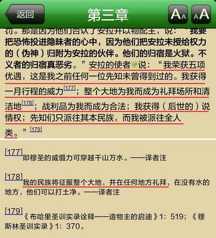

# 伊斯兰 for 卡菲尔
### 写这个小册子的目的是什么？
帮助广大长期被虚假宣传蒙蔽的非穆群众了解伊斯兰的真实教义。

----
### 你是不是在传播非法宗教书籍？
本文所引用的材料皆来自国内正规出版机构，它们是：
* 《古兰经》(译者：马坚；出版社：中国社会科学出版社)
* 《伊本·凯西尔古兰经注》(作者：伊本·凯西尔；出版社：中国社会科学出版社)
* 《古兰经简明基础教程》(中国伊斯兰教协会全国经学院统编教材)
* 《布哈里圣训实录全集》(译者：康有玺；出版社：经济日报出版社)
* 《圣训简明基础教程》(中国伊斯兰教协会全国经学院统编教材)
* 《伊斯兰教法》(作者：散比德·萨比格；出版社：和平书局有限公司；80年代以来一直作为经堂里的教材通用国内)
* 《伊斯兰教教法简明教程》(全国伊斯兰教经学院专业课统编教材)

对于想学习伊斯兰知识，但却不想花钱购买纸质版古兰经的朋友，我这里给出电子版(或安卓应用)的下载地址：
* 
* 
* 
* 【适合PC机阅读的电子版打包下载】  (解压密码：zifei) 

----
### 你是不是在断章取义？
本文在引用古兰经、圣训时都会给出相应的章节号、编号。
是不是断章取义，请各位读者根据我给出的章节号翻阅古兰经、圣训，自行判断。

----

### 请问你是穆斯林吗？你身边有穆斯林吗？你了解穆斯林吗？你有什么资格说这些话？
### 什么是伊斯兰？
伊斯兰是一种宗教，信仰这种宗教的人自称穆斯林。
伊斯兰是在犹太教、基督教的基础上发展而来的，跟犹太教、基督教一样，是一种一神教。

所谓一神教，是指……(todo)

伊斯兰教与犹太教、基督教的关系
这三者是一脉相承，他们之间的关系（过于）简单地说就是：爷爷、爸爸、孙子的关系。
为什么我不说：爷爷、爸爸、儿子呢？
因为伊斯兰教相比基督教，伊斯兰更加接近犹太教。

与基督教中人物的对应关系：
||圣经||古兰经||
||亚当||阿丹||
||撒旦||易卜劣厮||
||摩西||穆萨||
||耶稣||尔撒||

----

### 什么是卡菲尔？
说到穆斯林，就不得不说到一个与穆斯林相对的概念，这就是卡菲尔（也叫卡菲勒、卡费勒、卡斐伦，英语kafir）。
卡菲尔如果意译过来就是“不信道者”。
所谓不信道者，就是指那些拒绝信仰伊斯兰的人。在这里，“道”是指伊斯兰。

【卡菲尔的含义】
* 维基百科:an Arabic term used in an Islamic doctrinal sense, usually translated as unbeliever, disbeliever, or infidel
* 柯林斯英语词典:(among Muslims) a non-Muslim or infidel
* 美国传统词典:An infidel.
* 牛津词典:a person who is not a Muslim (used chiefly by Muslims). 

伊玛目安萨里在谈到了穆阿泰兹赖及一些异端派时说：“宁可错放一千个卡非尔，而不可错杀一个穆斯林。”()

伪信者是假称信仰伊斯兰的人。
他们是卡菲尔（即不信道者）的一种。
一般被视为最坏的卡菲尔。

----

### 什么是古兰经？
古兰经是一本书的名字，作者是穆罕默德。
书的内容是真主与穆罕默德的对话（其实是真主在说，穆罕默德在听）。
在这些对话中，真主授予穆罕默德教化人类的权力，并指示穆罕默德如何教化人类。

在穆斯林看来，古兰经的作者不是穆罕默德，而是真主。

古兰经分为两部分，一部分是穆罕默德在麦加创作的，一部分是在麦地那创作的。

----

### 什么是圣训？
圣训不是某本书的名字。
但有很多本书的名字里包含着“圣训”二字，比如：《布哈里圣训实录》、《穆斯林圣训实录》、《艾布·达吾德圣训集》
这些书即所谓圣训集。顾名思义，圣训集中收录着若干条圣训。
那圣训又是什么呢？
所谓“圣”，是指穆罕默德。
每一条圣训都是对穆罕默德生前言行的记录，其主要内容是穆罕默德对伊斯兰教义、律例、制度、礼仪及日常生活各种问题的意见主张。另外也包括穆罕默德的行为准则与道德风范。除此之外，圣门弟子谈论宗教、经训和实践教理等的言行，凡经穆罕默德认可和赞许的也被列为圣训的范围。

圣训集的编者要负责考证每一条“圣训”的真实性，确定穆罕默德是否真的说过此话，或者穆罕默德是否真的做过这件事情。
下面列出的是一些著名圣训集：
《布哈里圣训实录》
《穆斯林圣训实录》
《艾布·达吾德圣训集》
《提尔密济圣训集》
《奈萨仪圣训集》（又称《圣训小集》或《穆吉台巴圣训集》）
《伊本·马哲圣训集》

最后这本《伊本·马哲圣训集》，其中包含的一些圣训，有些圣训学家认为不太靠谱。

顺便告诉大家，“爱国是信仰的一部分”这是条假圣训。

----

### 什么是伊斯兰教法？
伊斯兰教法又称沙里亚法。

    (伊斯兰教教法简明教程) 按照伊斯兰教的基本观点，沙里亚是安拉赐予的
    根本大法，其内容永无谬误，永恒不变，适用于一切时代和所有空间，穆斯
    林个人与社会只有对其加以理解和遵守的义务，而无质疑、抗拒的权利。

    (伊斯兰教教法简明教程) 世俗法是人或国家制定的，而伊斯兰教教法是人
    类的主宰安拉制定的，因此它的神圣性与永恒性完全排除了人为立法修正的
    因素，是无始无终、亘古长存的天启法律。

----

### 真主跟上帝是什么关系？
基督教源自犹太教，伊斯兰教源自基督教和犹太教
上帝在犹太教中叫雅威(这是犹太语)
在基督教中叫耶和华
在伊斯兰教中叫安拉(这是阿拉伯语)

真主跟上帝一样，是汉语译名。

在伊斯兰教徒看来，他们的真主就是犹太教、基督教的上帝。

----

### 真主跟安拉是什么关系？
“安拉”是“真主”一词在阿拉伯语中的发音。
“胡达”是“真主”一词在波斯语中的发音。
维族人爱用胡达，回族人爱用安拉。
古兰经的英文版将真主翻译为God（上帝）。

----

### 真主跟穆罕默德是什么关系？

穆罕默德宣称：真主存在，且真主是世界上唯一的神，而他本人是真主派来的使者。

todo：清真言

----

### 什么是使者，什么是先知？

----

### 天园与火狱
天园即天堂
火狱即地狱，因以燃烧着烈焰，故称之为火狱。

----

### 古兰经真的说天堂里有72处女？

    穆圣说:安拉准许进入乐园的每个人,安拉均让他聘娶70位妻子,2位仙女,70
    位是从火狱居民上继承的.她们每一位均有性欲旺盛器, 他有永不弯曲的阳
    器. 西沙姆·本·哈立德说:从火狱居民中继承的,就是进入乐园的人,乐园的
    人继承他们的妻子(假如他们进入乐园,那些仙女就归他们所有),正如法老的
    妻子们被人继承一样

----

### 什么是圣战？
圣战，即吉哈德。
是为主道而奋斗的意思。
而“为主道而奋斗”包含的意思就多了，比如：……
但其中最重要的就是为主道而作战。

    (伊斯兰教法) 为主道出战是最贵的善功之一，所谓为主道出战就是宣扬真
    主之言，让人们服从真主的引导，归依正教……伊斯兰把为主道出战叫为出
    家修行

注意：这可不是什么宣扬暴恐的非法宗教出版物，此书80年代以来一直作为经堂里的教材通用国内，也就是说，宣扬暴恐的合法宗教出版物。

----
### 穆斯林为什么不吃猪肉？

因为古兰经中说`它们确是不洁的`。

古兰经中的相关经文：

    (古兰经6:145) 你说：“在我所受的启示里，我不能发现任何人所不得吃的
    食物；除非是自死物，或流出的血液，或猪肉——因为它们确是不洁的——或是
    诵非真主之名而宰的犯罪物。”凡为势所迫，非出自愿，且不过分的人，
    （虽吃禁物，毫无罪过），因为你的主确是至赦的，确是至慈的。

那为什么猪肉是不洁的呢？
这个我无法回答，任何人都无法回答。

有些穆斯林(比如古兰经中文版的翻译者马坚)给出了以下解释：
* 猪貌丑、怪异，性贪婪、愚笨
* 猪喜污秽。其生活区域肮脏不堪，食用的饲料也是污秽的，难与食草类动物相比
* 猪性恶无常
* 猪乱伦交配
* 一些貌似出于“科学”原因的解释

但这些理由都是解释给外人听的，穆斯林不吃猪肉只有一个原因：因为古兰经中说`它们确是不洁的`。
另外，大家记住犹太教也不吃猪肉，而伊斯兰是从犹太教发展而来的。至于为什么不吃猪肉，恐怕只有犹太人的祖先能说的清了。

----
### 伊斯兰是“和平”的意思吗？
我们经常听到的一种说法是：伊斯兰意为“和平”，伊斯兰是“和平的宗教”。
但这似乎与我们的印象正好相反——大多数恐怖分子都是穆斯林——和平的宗教。
这些恐怖分子是不是
伊斯兰真的是“和平”的意思吗？
我们来看中国伊斯兰教协会全国经学院统编教材《古兰经简明基础教程》对“伊斯兰”一词的解释：

由此可见，在穆斯林的心目中，“和平”是“顺从”的同义词，“战争”是“违抗”的同义词。
也就是说，伊斯兰一词包含了两层意思：其一是“顺从”，其二是“和平”。
“顺从”是指顺从谁呢？“违抗”又是指违抗谁呢？
答案是显而易见的——真主。

所以说，伊斯兰这个词的真正含义是“顺从真主，得到和平”。
那如果不顺从真主呢…违抗/战争

所以说，将“顺从真主，得到和平”等同于“和平”，其实就是将“如果A，那么B”等同于“B”。
对逻辑学有稍许了解，就应当清楚这是两个截然不同的命题。

todo：伊斯兰国那份声明

----

### 恐怖分子是不是真的穆斯林？
todo：判断一个人是否穆斯林的依据？

todo：谁是穆斯林的判断权在谁手里？

todo：判定叛教的依据？

### 中国伊斯兰教协会有权开除恐怖分子的教籍吗？
念过清真言，就是穆斯林。也就是他们没有权力开除一个人的“穆斯林”身份，包括恐怖分子。

----

### 恐怖分子都没有读过古兰经？
没读过不代表不掌握古兰经的思想

读过只会更暴恐

----

### 什么是塔基亚原则？
穆斯林可以隐瞒自己的宗教信仰。

----

### 穆斯林可以与卡菲尔和平相处吗？
很遗憾，答案是不能，这是伊斯兰教义规定的。

----

### 穆斯林为什么不吃猪肉？
真主在古兰经中禁止穆斯林食用猪肉。
禁止食用的原因是真主认为猪肉不洁。
那真主为什么说猪肉不洁呢？
在古兰经中找不到答案。

不吃猪肉不是伊斯兰教的独创，犹太教、基督教都有禁食猪肉的教义。伊斯兰是从这两者继承下来的。
至于犹太教为什么不吃，就不得而知了。

----

### 没有猪肉就是清真食品吗？
NO！没有猪肉是指成为清真食品的必要条件，而非充分条件。

----

### 在穆斯林心中，宪法与古兰经孰轻孰重？
叛教罪在伊斯兰教法中是死刑,附图是证明叛教的特征.第5条最后那个“并”字有点奇怪,不过第2条后有相同结构,由此可见,只要“认为人为宪法优越于经、训”就是叛教.一种宗教,还伴随着一整套法律,这对生活在非穆国家,还要服从非穆法律的穆斯林来说可真是个难题.到底是该叛国呢?还是该叛教呢?前者未必死罪 

伊斯兰教经学院的教材那段：

----

### 世界上没有比“不信道”更大的恶
什么杀人放火，在“不信道”面前都是微不足道的小恶。

----

### 伊斯兰中的“善”与卡菲尔无关
伊斯兰教义规定了很多善功，要求穆斯林履行。这其中就包括施舍。
施舍给穆斯林是教义规定的义务，但施舍给不敌视（其实是不反抗）伊斯兰的卡菲尔，则仅仅是“不禁止”。

未曾为你们的宗教而对你们作战，也未曾把你们从故乡驱逐出境者，真主并不禁止你们怜悯他们，公平待遇他们。(古兰经60:8)

然而，想成为不反抗伊斯兰的卡菲尔是非常困难的，因为明确地拒绝伊斯兰就是一种反抗。
TODO：以上部分需要强化

伊斯兰给狗一口水喝都有善功。

----

### 为什么伊斯兰的教义具有攻击性
这与穆罕默德的生平有直接关系。

麦加-麦地那-麦加
暴恐教义多产自麦地那期间

穆罕默德一生分为两个阶段：前一阶段在麦加，羽翼未丰，学耶稣打左脸给右脸；
后一阶段在麦地那，羽翼丰满，顺我者昌逆我者亡。
穆斯林洗地用的多是麦加时期的教义，他们不会告诉你麦地那的教义。

----

### 穆斯林可以退教吗？
信不信伊斯兰不是个人的事情
伊斯兰不是一种个人修行的宗教，它具有强烈的社会性、政治性。
伊斯兰的政教合一是与生俱来的。
按照伊斯兰教法，退教属于叛教，是死罪。

【伊斯兰教法的叛教罪】注意几点:1.叛教是死刑 2.认为宪法高于古兰经即为叛教(图3) 3.伊斯兰教法跟古兰经、圣训不一样,它不是某本具体的书的名字,它是历代伊斯兰教法学家根据古兰经跟圣训搞出来的东西,古有四大教法学家,而本书是现代教法学家编的,据说“此书80年代以来一直作为经堂里的教材通用国内”

### 叛教为什么必须是死罪？
叛教为什么必须死，伊斯兰教法给出的解释： 谁加入伊斯兰，了解其真谛后叛教者，谁已违背了真理，相反了逻辑，否绝了证据和明证。丧失了健全的理智，违背了天性。谁到达这种地步，谁确已掉入堕落的深渊，陷入孽海，对这种人的生命不应该保护，不希望他生存。因为他的生命中没有高尚的目的和崇高的志向

叛教罪在伊斯兰教法中是死刑,附图是证明叛教的特征.第5条最后那个“并”字有点奇怪,不过第2条后有相同结构,由此可见,只要“认为人为宪法优越于经、训”就是叛教.一种宗教,还伴随着一整套法律,这对生活在非穆国家,还要服从非穆法律的穆斯林来说可真是个难题.到底是该叛国呢?还是该叛教呢?前者未必死罪

----

### 什么是清真？
符合沙里亚法
对于吃的东西，如何才是符合沙里亚法呢？

----

### 清真食品真的卫生吗？

    (布哈里圣训实录全集235) 有人问使者：“老鼠掉进奶油里怎么办？”使者
    答：“扔掉老鼠及其周围的奶油，余下的奶油你们仍可食用。”

    (布哈里圣训实录全集3320) 使者说：“如果一只苍蝇飞进你们谁的饮料中，
    那他应把苍蝇在饮料中浸一下后再取出扔掉，因为苍蝇的一只翅膀上带有病
    菌，而另一只翅却带有解药。”

----

### 古兰经教唆穆斯林杀掉自己的卡菲尔孩子

古兰经18:74、18:80 鼓吹杀掉自己的卡菲尔儿子

完整故事如下：

    18:65 他俩发现我的一个仆人，我已把从我这里发出的恩惠赏赐他，我已把
          从我这里发出的知识传授他。

    18:66 穆萨对他说：“我要追随你，希望你把你所学得的正道传授我。好吗？”

    18:67 他说：“你不能耐心地和我在一起。
    18:68 你没有彻底认识的事情你怎么能忍受呢？”
    18:69 穆萨说：“如果真主意欲，你将发现我是坚忍的，不会违抗你的任何命令。”
    18:70 他说：“如果你追随我，那末，（遇事）不要问我什么道理，等我自己讲给你听。”
    
    18:71 他俩就同行，到了乘船的时候，他把船凿了一个洞，穆萨说：“你把
          船凿了一个洞，要想使船里的人淹死吗？你确已做了一件悖谬的事！”
    18:72 他说：“我没有对你说过吗？你不能耐心和我在一起。”
    18:73 穆萨说：“刚才我忘了你的嘱咐，请你不要责备我，不要以我所大难的事责备我！”
    
    18:74 他俩又同行，后来遇见了一个儿童，他就把那个儿童杀了，穆萨说：
         “你怎么枉杀无辜的人呢？你确已做了一件凶恶的事了！”
    18:75 他说：“难道我没有对你说过吗？你不能耐心地和我在一起。”
    18:76 穆萨说：“此后，如果我再问你什么道理，你就可以不许我再追随你，你对于我，总算仁至义尽了。”
    18:77 他俩又同行，来到了一个城市，就向城里居民求食，他们不肯款待。
          后来他俩在城里发现一堵墙快要倒塌了，他就把那堵墙修理好了，穆萨说：
         “如果你意欲，你必为这件工作而索取工钱。”
    18:78 他说：“我和你从此作别了。你所不能忍受的那些事，我将告诉你其中的道理。
    18:79 至于那只船，则是在海里工作的几个穷人的，我要使船有缺陷，
        是因为他们的前面有一个国王，要强徵一切船只。
    18:80 至于那个儿童，则他的父母都是信道者，我们怕他以悖逆和不信强加于他的父母，
    18:81 所以我们要他俩的主另赏赐他俩一个更纯洁、更孝敬的儿子。
    18:82 至于那堵墙，则是城中两个孤儿的；墙下有他俩的财宝。他俩的父亲，原是善良的。
        你的主要他俩成年后，取出他俩的财宝，这是属于你的主的恩惠，我没有随著我的私意做这件事。
        这是你所不能忍受的事情的道理。”

### 古兰经教唆穆斯林杀掉自己的卡菲尔父亲

相关经文：

    (古兰经58:22) 你不会发现确信真主和末日的民众，会与违抗真主和使者的
    人相亲相爱，即使那等人是他们的父亲，或儿子，或兄弟，或亲戚。

十大圣门弟子之艾布·欧拜德杀死卡菲尔父亲，真主以乐园向他报喜…

[故事如下](http://www.yslzc.com/rw/shenmen/shenmen/200801/22364.html)：

艾卜·欧拜德在麦加从开始信教到迁徙，经历了残酷的考验。他和早期的穆斯林一样遭受了世界上信教者所未曾遭遇过的那种凶恶、残忍、痛苦的灾难，他们坚定地忍受了。

他在每个场合都确信真主和使者，白德尔战役中，他遭受的灾难其凶恶程度超过了人们的预料和想象。那天他在两队中间不怕死地迂回袭击敌人。敌人怕了，他们的骑兵注意到了他，每当迎面遇上他，敌人就回避，但他们中的一人，总是在每个方向出现面对艾氏。艾氏叫他让开路、不愿见他，此人就坚持进攻；艾氏多次回避，此人却堵住了艾氏的去路，阻碍着艾氏与真主的敌人厮杀。在如此情况下，艾氏忍无可忍；用剑砍了他的头，一下子头成了两半，一具僵尸倒在了艾氏的面前。尊贵的读者，你猜不出这倒下的人是谁，我对你没有说过吗？凶恶的考验出乎人们的意料和想象？！当你知道这倒下者是艾氏的生身父亲时，你的头会破裂的。

艾氏没有杀他的父亲，他杀的是他父亲身上存在的“以物配主行为。”为艾氏和他父亲的事件真主降示了《古兰经》：“你不会发现确信真主和末日的民众，会与违抗真主和使者的人相亲相爱。即使那等人是他们的父亲，或儿子，或兄弟，或亲戚。这等人，真主曾将正信铭刻在他们的心上，并且以从他降下的精神援助他们，他将使他们入下临诸河的乐园，而永居其中。真主喜悦他们，他们也喜悦真主。这等人是真主的党羽，真的，真主的党羽确是成功的。”(58：22)对艾氏来说这不算奇怪，因为他信仰真主，忠于真主的宗教，忠于穆罕默德的民族的信念极为坚强；他的坚强引起许多人羡慕。

----

### 伊斯兰教与犹太教、基督教的关系

----

### 伊斯兰与多元化
[视频: 穆斯林移民给英国带来的惊人变化](http://t.cn/zQWeraS)

绵羊圈里放几只山羊或许能叫多元化，但放一只狼进去，那不叫多元化，那叫引狼入室，自取灭亡。多元化容得下伊斯兰，但伊斯兰容不下多元化。

todo：某汉穆写的伊斯兰与多元化的文章

----

### 回回、回民、回族、穆斯林，这些词一样吗？
Hui Chinese还是Arab Chinese

----

### 古兰经不是说“枉杀一人的，如杀众人”吗？

“凡枉杀一人的，如杀众人；凡救活一人的，如救活众人”，所谓爱国宗教人士，经常断章取义地引用这段古兰经文，来欺骗卡菲尔说：“伊斯兰禁止恐怖分子乱杀无辜”，但其实，在这段话之前，真主刚刚讲完一个故事：不信道的该隐枉杀了自己的亲弟弟——信道者亚伯。(熟悉基督教的朋友对这个故事一定不陌生)

这段经文全文如下(本句位于5:32)：

    5:27 你当如实地对他们讲述阿丹的两个儿子的故事。当时，他们俩各献一
         件供物，这个的供物被接受了，那个的供物未被接受。那个说：“我
         必杀你。”这个说：“真主只接受敬畏者的供物。
    5:28 如果你伸手来杀我，我绝不伸手去杀你；我的确畏惧真主——全世界的
         主。
    5:29 我必定要你担负杀我的罪责，和你原有的罪恶，你将成为火狱的居民。
         这是不义者的报酬。”
    5:30 他的私欲撺掇他杀他的弟弟。故他杀了他之后，变成了亏折的人。　
    5:31 真主使一只乌鸦来掘地，以便指示他怎样掩埋他弟弟的尸体。他说：
        “伤哉！我怎不能像这只乌鸦那样，把我弟弟的尸体掩埋起来呢？”于
         是，他变成悔恨的人。
    5:32 因此，我对以色列的后裔以此为定制：除因复仇或平乱外，凡枉杀一
         人的，如杀众人；凡救活一人的，如救活众人。我的众使者。确已昭
         示他们许多迹象。此后，他们中许多人，在地方上确是过分的。

所以，这段话在穆斯林读来，完全是截然不同的另一种感受：卡菲尔该隐杀死了自己的亲弟弟——穆斯林亚伯。作恶的又是卡菲尔，作恶的从来都是卡菲尔，为什么卡菲尔作恶？因为他们不敬畏真主，不敬畏真主就是最大的恶，穆斯林替天行道（即奉真主之名） 惩罚卡菲尔。如果穆斯林杀穆斯林、出卖穆斯林，那他就变成了卡菲尔，作为穆斯林你杀害、出卖自己人，就如同杀害、出卖所有穆斯林。

为什么我们平时总是见穆斯林杀戮穆斯林？因为他们不认为对方是穆斯林。只要他们认为对方有损于自己（他们当然认为自己是真穆斯林），他们就可以认定对方变成了卡菲尔，就可以杀戮对方。

如果大家对我的解读还存疑的话，请看权威的《伊本·凯西尔古兰经注》对这段经文的注解：

    (伊本·凯西尔古兰经注) 阿拔斯说：“谁枉杀了安拉禁止杀害的一个人，犹
    如枉杀了全人类。”赛尔德·本·朱拜尔说：“剥夺一个穆斯林的性命的人，
    犹如剥夺了全体穆斯林的性命。”穆佳黑德说：“谁故意杀死一个穆斯林，
    安拉必定让谁进入火狱，并会恼怒他，诅咒他，为他准备惨痛的惩罚。”

大家明白了没有？只有穆斯林才可能被“枉杀”，卡菲尔连被“枉杀”的权利都没有，卡菲尔死是罪有应得。

如果您还不敢相信，我们再来看古兰经5:32这节对应的英文版：

    (古兰经5:32) On that account: We ordained for the Children of
    Israel that if any one slew a person - unless it be for murder or
    for spreading mischief in the land - it would be as if he slew the
    whole people: and if any one saved a life, it would be as if he
    saved the life of the whole people. Then although there came to
    them Our apostles with clear signs, yet, even after that, many of
    them continued to commit excesses in the land.

请大家注意这句：unless it be for murder or for spreading mischief in the land

如何就是“spreading mischief”呢？在英文版古兰经中搜索mischief一词，基本上都是与卡菲尔相关的，即不信仰真主就是mischief。
如古兰经3:63

    (古兰经3:63) 如果他们背弃正道，那么，真主对于作恶的人，确是全知的。
    (古兰经3:63) But if they turn back, Allah hath full knowledge of those who do mischief.

除此之外，大家还可以通过另外一段经文来加深对“枉杀”的理解。

    18:74 他俩又同行，后来遇见了一个儿童，他就把那个儿童杀了，穆萨说：
         “你怎么枉杀无辜的人呢？你确已做了一件凶恶的事了！”
    ……
    18:80 至于那个儿童，则他的父母都是信道者，我们怕他以悖逆和不信强加于他的父母，
    18:81 所以我们要他俩的主另赏赐他俩一个更纯洁、更孝敬的儿子。

因为那个儿童是卡菲尔，所以杀他不是“枉杀”。

----

### 听说有一条圣训是“爱国是信仰的一部分”，是真的吗？
当像小鸟热爱自己的巢穴一样热爱自己的祖国

----

### 女性在伊斯兰中的地位
三元：穆斯林、女人、卡菲尔

火狱里多数都是女人
卡菲尔的妻子在天堂充当性奴
四个老婆

【关于穆斯林打老婆】古兰经(4:34)中有一条，大意就是：如果妻子不服从丈夫，那么就可以打。然后圣训中有一条(布哈里29)，大意就是：妇女若敢叽歪就下火狱。——当然呢，不管别的穆斯林怎么样，穆罕默德本人不愧是好老公(以我的认识)，他说过“你们之中最好的人，是对妻室仁慈的人”(利雅得圣训)。

----

### 逊尼派与什叶派
穆斯林主要分为逊尼派、什叶派
逊尼派是主流。
绝大部分阿拉伯人、突厥人（包括我国的维族），信仰的都是逊尼派。

什叶派是非主流，伊朗是什叶派的大本营。

逊尼派与什叶派都认为对方是伪信者，即最坏的卡菲尔，这一原因导致两派间的仇恨甚至要大于穆斯林对非穆（即普通卡菲尔）的仇恨。
当然，逊尼派与什叶派的矛盾还跟阿拉伯人与波斯人的恩怨的有关。

----

### 瓦哈比是邪教吗？
这个问题相当于在问“伊斯兰是邪教吗？”

----

### 哲合忍耶
### 新教与老教
### 伊斯兰有无可能世俗化
类比古猿

----

### 穆斯林认为伊斯兰是不受时空限制的绝对真理

    (古兰经基础简明教程) 在真主派遣的所有使者中，穆罕默德是最后一位使
    者，而在他以前的众使者，他们的使命有一定的局限性，要么是针对一个民
    族的，要么是针对一个时代的，有时间和空间的限制。而穆圣的使命是面向
    全人类全世界的，具有普遍的意义和普世的价值

----

### 强奸卡菲尔

请大家参考中国伊斯兰教协会全国经学院统编教材编《圣训基础简明教程》中的一段：

我们可以看到，穆斯林在战争中俘获了不少卡菲尔，强奸了其中的年轻女性，等到要射精时采取了体外射精。他们就体外射精来请教穆圣(注意：不是就强奸一事请教)，而穆圣显然也不关心强奸一事。更令人惊讶的是，在这本我国官方出版的教材中，穆斯林从中学到的竟然是关于避孕是否合法的知识。

todo：临时婚姻

----

### 诬陷卡菲尔

    (伊斯兰教法 第四章 诬陷罪 第四节 第3条) 众学者主张：……若被诬陷者
    是非穆斯林，诬陷者不受法度。

----

### 难道你要因为卡菲尔下火狱而批评伊斯兰吗？
火狱并不特别，用后世永恒的惩罚吓唬不信者，是很多宗教都有的套路。但煽动教徒在现世就向不信者发起攻击的，恐怕才是伊斯兰的特色。

    (古兰经9:123) 信道的人们啊！你们要讨伐邻近你们的不信道者，使他们感
    觉到你们的严厉。

所以说，伊斯兰教具有极强的现实攻击性。

----

### 圣战进天堂是真是假？
这个我不便说，党和政府说是假的。
但大家看古兰经中是怎么说的，然后自行判断。

    (古兰经3:169) 为主道而阵亡的人，你绝不要认为他们是死的，其实，他们
    是活着的，他们在真主那里享受给养。

----

### 恐怖分子不怕死吗？
对死亡的恐惧，是人类的本能。
但如果能够让一个人确信自己是安全的，那么他将不再恐惧。
最简单的例子，让你走杂技演员走的那种高空钢丝，你肯定不敢走。
但是给你系上安全带，很多人就敢走了，因为你知道有了安全带，自己即便失足，也不会死。

穆斯林确信古兰经上的一字一句，其程度甚至超过你对安全带的信任程度。
我们再来看古兰经上怎么说…

    (古兰经3:169) 为主道而阵亡的人，你绝不要认为他们是死的，其实，他们
    是活着的，他们在真主那里享受给养。

----

### 不信伊斯兰教就是卡菲尔吗？
卡菲尔是个坏词

中国穆斯林的灰色地带
这是非穆国家的穆斯林为了调和教义与现实而划定的穆斯林与卡菲尔之间的灰色地带，可以留你不杀，也便于穆斯林自保。
一旦穆斯林占据多数，谁敢说自己还不知道伊斯兰讲的啥？那时候，所有非穆就瞬间成了该死的卡菲尔

但是马坚将卡菲尔翻译为不信道者。

马坚版《古兰经》第109章的章名即“不信道的人们”，马坚在章名后加了个括号，里边注明“卡斐伦”。由此可见不信道的人们就是卡斐伦的意译。

----

### 穆斯林志在征服全世界
我们来看《伊本凯西尔古兰经注》中的一段

请注意：“我的民族将征服整个大地”一句中，“我的民族”一词是指穆斯林。

----

### 穆斯林可以跟卡菲尔和平相处吗？

古兰经9:2规定穆斯林不得与卡菲尔永久和平。大家可以看伊本凯西尔古兰经注第九章，这章宣布穆斯林与卡菲尔之间的永久和平协定无效。

    第九章 忏悔（讨白）
    这章是麦地那的，全章共计一二九节。 
    9:1 （这是）一篇解除盟约的宣言，从真主及其使者传示那些曾与你们缔约的以物配主者。
    9:2 （以物配主者啊！）你们可以在地面上漫游4个月，你们须知自己不能逃避真主的谴责，（须知）真主是要凌辱不信道者的。
    9:3 （这是）从真主及其使者在大朝之日传示众人的通告：真主及其使者对于以物配主者是无干的。如果你们悔过，那对于你们是更好的，如果你们背离，那末，须知你们不能逃避真主的谴责。你以痛苦的刑罚向不信道者报喜吧。
    9:4 但以物配主的人们中曾与你们缔结盟约，而没有任何违背，也没有资助任何敌人者，你们应当遵守与他们缔结的盟约，直至满期。真主确是喜爱敬畏者的。
    9:5 当禁月逝去的时候，你们在哪里发现以物配主者，就在那里杀戮他们，俘虏他们，围攻他们，在各个要隘侦候他们。如果他们悔过自新，谨守拜功，完纳天课，你们就放走他们。真主确是至赦的，确是至慈的。
    9:6 以物配主者当中如果有人求你保护，你应当保护他，直到他听到真主的言语，然后把他送到安全的地方。这是因为他们是无知的民众。
    9:7 在真主及其使者看来，以物配主者怎么会有盟约呢？但在禁寺附近与你们缔结盟约的人，在他们为你们遵守盟约的期间，你们当为他们遵守盟约。真主确是喜爱敬畏者的。
    9:8 他们怎么会有盟约呢？如果他们战胜你们，他们对你们就不顾戚谊，不重盟约。他们用甜言蜜语使你们喜欢，他们的内心却不肯实践诺言，他们大半是违约的。
    9:9 他们以真主的迹象换取轻微的代价，因而背离真主的大道。他们的行为确是恶劣的。
    9:10 他们对信士不顾戚谊，不重盟约。这等人确是过分的。
    9:11 如果他们悔过自新，谨守拜功，完纳天课，他们就是你们的教胞。我为有知识的民众解释许多迹象。
    9:12 如果他们在缔约之后违反盟约，而且诽谤你们的宗教，你们就应当讨伐迷信的头子们——其实，他们并无所谓盟约——以便他们停止罪行。
    9:13 有一族人已经违反盟约，要想驱逐先知，而且首先进攻你们。你们怎么还不讨伐他们呢？难道你们畏惧他们吗？真主是你们更应当畏惧的，如果你们确是信士。
    9:14 你们应当讨伐他们，真主要借你们的手来惩治他们，凌辱他们，并相助你们制服他们，以安慰信道的民众，
    9:15 而消除他们心中的义愤。真主将准许他所意欲的人悔过自新。真主是全知的，是至睿的。

----

### 如何迫害一位穆斯林？
想必大家都听说过下边这个笑话：

    艾哈迈德·易卜拉欣忧心忡忡地说：“从美国到俄国、从西欧到东亚，甚至
    非洲，形成一个歧视迫害虐待穆斯林的联盟。人不应因信仰受虐待，必须让
    世界善良人们伸出正义之手，挽救和平宽容伊斯兰信仰。” “等下”我说：
    “他们怎么虐待你们了？” “他们既不肯皈依伊斯兰，又不肯去死！”艾
    哈迈德一脸悲愤地说。

但这个真的不是笑话，因为穆斯林对“迫害”一词的理解，与我们平常的理解完全不一样。

    (古兰经8:39) 你们要与他们战斗,直到迫害消除,一切宗教全为真主

对于此处的“迫害”一词，伊本·阿拔斯等多数圣训学家都认为是指“以物配主”。也就是说，你不信伊斯兰，就是迫害穆斯林。

----

### 清真食品认证
### 穆斯林眼里合理的社会秩序

在这则圣训中，船代表穆斯林心目中合理的社会秩序——居于上层的穆斯林统治居于下层的卡菲尔，水代表自由。

----

### 打扰穆斯林做礼拜会有什么后果？
穆斯林做礼拜的时候，千万不要从其前经过，否则（理论上）你的小命堪忧。

    (布哈里圣训3274) 艾布·赛义德传述：使者说：“正当你们礼拜的时候，如
    果有人想从你们的前面经过，那么你们阻止他。如果那人执意过去，你们再
    制止他。如果那人一意孤行，那你们就和他战斗吧，因为这种人是魔鬼。

----

### 穆斯林是否会感卡菲尔的恩？
《伊本·凯西尔古兰经经注》 在对古兰经第18章《山洞》章的注释中告诉穆斯林，如果你反对的卡菲尔政府善待你、宽恕你，那是来自安拉的特慈。

----

### 是谁创造了真主？

    (伊斯兰教法) 穆圣说：“人们经常互相询问，真主创造了万物，那么，是
    谁创造了真主呢？谁有这种邪念时，谁就说：我确信真主。”

以下截图来自《伊斯兰教法》

----

### 穆斯林可以饮酒吗？

    (布哈里圣训实录全集5590) 艾布·阿穆尔（一说是艾布·马立克）传述：他
    曾经听使者说：“我的乌玛中将有一些人，他们认为非法的性关系、穿戴绸
    缎、饮酒和弹唱为合法。将会有一些人待在山的一边附近，他们的放牧人在
    晚上来到他们这里带着他们的羊，并且向他们要某些东西[107]，但是他们
    对牧羊人说：“明天再来。”安拉将会在夜间毁灭他们，会让山砸在他们上
    面。他会把他们当中的其余的人变成猴子和猪，他们将会一直是这样，直到
    复生日。”

那为什么你经常见到穆斯林饮酒？

----
### 卡菲尔在穆斯林眼里的形象？

因为卡菲尔没有信仰，或者不信仰真主，在穆斯林的眼里首先是行尸走肉、畜生的形象。

    (古兰经2:171) 你号召不信道者，就象叫唤只会听呼喊的牲畜一样。（他们）
    是聋的，是哑的，是瞎的，故他们不了解。

卡菲尔是穆罕默德敌人(自然也就是真主的敌人)，所以在穆斯林的眼里，卡菲尔还具有坏人、敌人的意思。

----
### 我有一个回族同学，他跟我们一样啊
我们都知道回族不等于穆斯林，但其实穆斯林仍可以继续划分：
* A类人虽然自称穆斯林，但他们明确拒绝古兰经、圣训中的部分教义，这类人
  其实是借用了伊斯兰词汇的另一种新一神教教徒，严格来说他们并不是穆斯林；
* B类人虽不敢拒绝教义，但他们不积极履行宗教义务，他们对真主会宽恕自己
  抱有侥幸心理；
* C类人虔诚有余但读经不多，缺乏理论，搞不出什么名堂；
* D类懂教义且虔诚，整天用伊斯兰的尺子量来量去。

穆罕默德对穆斯林也有一个分类：

    (布哈里圣训实录全集7560) 使者说：“习读且遵行《古兰经》的人犹如香橼，香橼又甜
    又香。不习读但遵行《古兰经》的人犹如椰枣，椰枣甜而不香。习读《古兰
    经》的伪信者犹如香草花，香草花虽香但其味酸苦。不习读《古兰经》的伪
    信者犹如野胡瓜，野胡瓜既酸苦又无香气。

我们不应该通过穆斯林的所做所为来认识伊斯兰教，因为：1.我们的目的不是认识伊斯兰教，而是认识穆斯林的心理动机以预测、预防潜在的危险； 2.世俗社会里穆斯林的所作所为是古兰经教义跟卡菲尔政府对冲平衡的结果，并不真实反映伊斯兰教义。作为卡菲尔，我们应该是通过伊斯兰教义来认识穆斯林。 

----

### 沙甸穆斯林禁酒的本质
【2012年沙甸禁酒事件的本质是宗教势力渗透国家机关】穆斯林金镖：据马管寺介绍，清真寺禁酒巡逻车协助有关部门执法。

----

### 我们应该尊重穆斯林的信仰？
【如何尊重别人的宗教信仰?】1.尊重的对象只能是人,脱离了尊重人而谈尊重信仰,是对无宗教信仰人群的歧视;2.尊重应该是相互的,你不尊重我,我却要尊重你,这种尊重本质上是对暴力的屈服;3.谁支持这种不对等的尊重,就是支持人压迫人,就是支持犯罪. 

----

### 穆斯林可以跟卡菲尔井水不犯河水？

    (古兰经第109章) 你说：“不信道的人们啊！ 我不崇拜你们所崇拜的， 你
    们也不崇拜我所崇拜的；我不会崇拜你们所崇拜的，你们也不会崇拜我所崇
    拜的；你们有你们的报应，我也有我的报应。”

穆斯林经常抛出这段，让人感觉他们能跟卡菲尔井水不犯河水，但根据《伊本·凯西尔古兰经注》，此章的降示背景是：愚蠢的古莱什人曾经企图和穆圣达成如下协议：穆圣崇拜古莱什人的偶像一年，（作为交换）则他们崇拜安拉一年。于是安拉降示本章，命令穆圣与多神教徒的崇拜完全划清界限。

也就是说，以上这段经文表达的并不是穆斯林跟卡菲尔可以井水不犯河水的意思，而是穆斯林绝不与卡菲尔妥协，势不两立的意思。

    (伊本凯西尔古兰经注) 清高伟大的安拉说，既然我赐给你恩典，给你正确
    的律令和崇高的品德，“所以你不要顺从否认者。他们希望你得过且过，随
    后他们也得过且过。(古兰经68:8-9，非马坚译本)”伊本·阿拔斯解释：
    “他们希望你妥协（承认他们的神），他们也允许你（去实践你的信仰）.”

### 中国的伊斯兰教派
【当代中国伊斯兰教教派的新格局】中国穆斯林(除新疆以外)从大的方面可以归纳为四个不同的教派:格迪目(中国化程度高)、门宦(哲合忍耶即在其中)、伊赫瓦尼(受瓦哈比影响而产生)和赛莱菲耶(即瓦哈比),而仅门宦一派又分属三大苏菲教团.我感觉是去中国化趋势日趋明显,越邪越有号召力

请参考：http://www.norislam.com/?viewnews-15237

----

### 穆斯林对穆罕默德崇拜

    (布哈里圣训实录全集2731) …我从未见过哪一个国王的手下有穆罕默德的
    门弟子们对穆罕默德那样的尊重！誓以安拉！他只要吐痰的话，定会有人接
    住抹在自己的脸上或身上；他要是下达什么命令，他们则舍生忘死地去完成；
    他如果洗小净的话，他们就会争夺剩下的小净水；他说话时，他们从不大声
    喧哗…

----

### 什么是以物配主？

### 为什么不能有穆罕默德的画像？

### 侵华日军对中国穆斯林的看法
日本人《支那的回教问题》:"我认为,富于煽动性,并具有雷同性,在特殊地域里成为特殊潜在势力的支那回教,在现今的形势之下就是支那的癌症.但是,除非到了支那自身被解剖手术切开之时,是无法将其剔除出去的.…”结论是,"回教"从根本上来说是中国的一个分裂因素,值得日本积极加以利用
地址：http://www.360doc.cn/article/28071_345474463.html
